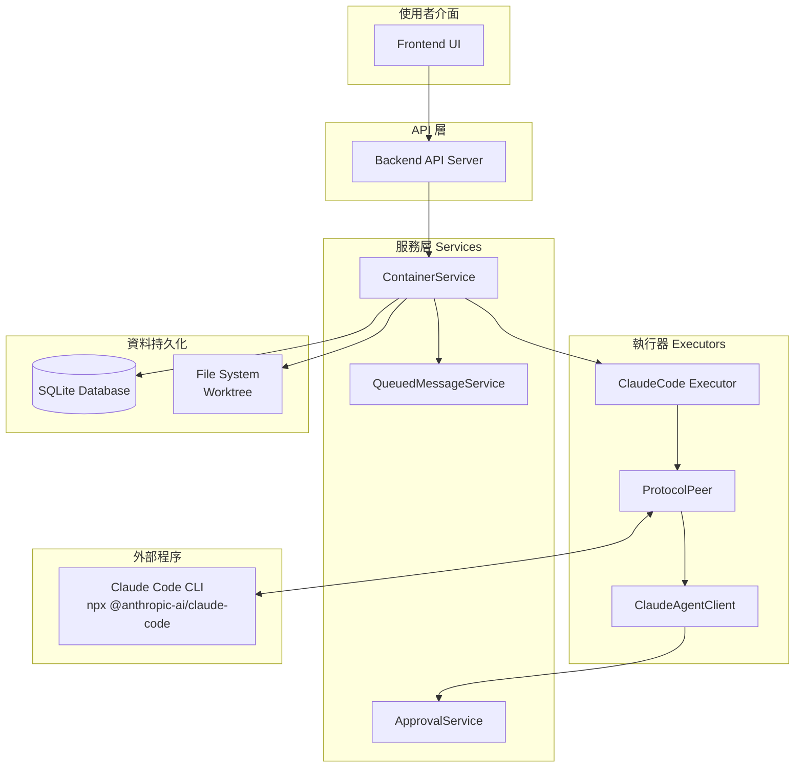
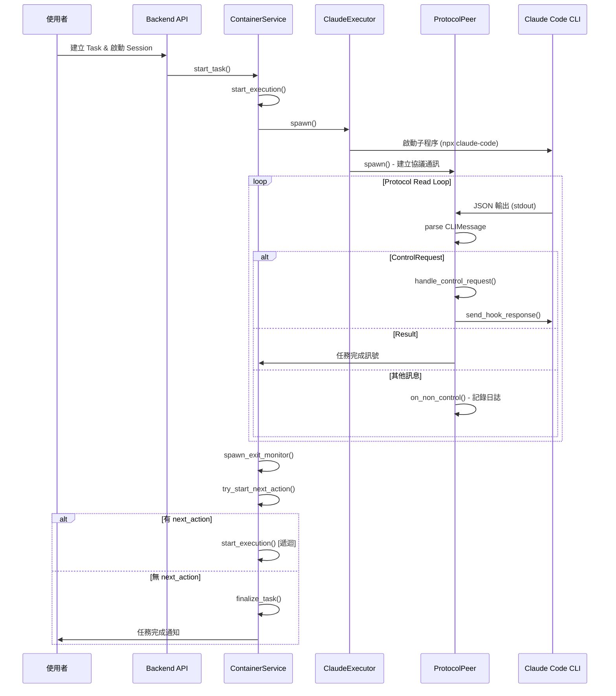

# Claude Code 執行流程總覽

> **文件編號**: DOC-001
> **對應任務**: [A.02] 撰寫 00-overview.md - Claude Code 執行流程總覽
> **最後更新**: 2026-01-16

## 概述

本文件描述 Vibe Kanban 專案中 Claude Code 的執行流程。當使用者建立一個 Task 並啟動 Workspace Session 時，系統會透過 Claude Code Executor 來執行 AI 編碼代理任務。

## 核心問題解答

### Q: 執行 Claude Code 時，是否有啟用 Loop 循環機制直到任務完成？

**答案: 是的，系統確實有多層 Loop 機制**

系統透過以下三個層次的 Loop 機制確保任務持續執行直到完成：

1. **Protocol Read Loop** (`protocol.rs:46-101`)
   - 持續讀取 Claude Code 的 stdout 輸出
   - 使用 `tokio::select!` 同時監聽輸出和中斷訊號
   - 只有在收到 `Result` 訊息或 EOF 時才會跳出

2. **ExecutorAction Chain** (`container.rs:1165-1198`)
   - 每個 ExecutorAction 可包含 `next_action` 指標
   - 透過 `try_start_next_action()` 遞迴呼叫 `start_execution()`
   - 實現 Setup Script → Coding Agent → Cleanup Script 的鏈式執行

3. **Exit Monitor Loop** (`local-deployment/container.rs:344-563`)
   - `spawn_exit_monitor()` 啟動背景監控任務
   - `spawn_os_exit_watcher()` 每 250ms 輪詢程序狀態
   - 程序結束後自動觸發下一動作或任務完成

## 高層架構圖

## 執行流程概覽

## 核心程式碼位置

| 元件 | 檔案路徑 | 說明 |
|------|----------|------|
| Claude Executor | `crates/executors/src/executors/claude.rs` | 主要執行器實作 |
| Protocol Handler | `crates/executors/src/executors/claude/protocol.rs` | 雙向協議通訊 |
| Agent Client | `crates/executors/src/executors/claude/client.rs` | 權限審批處理 |
| Container Service | `crates/services/src/services/container.rs` | 任務編排服務 |
| Local Container | `crates/local-deployment/src/container.rs` | 本地部署實作 |
| Coding Agent Initial | `crates/actions/coding_agent_initial.rs` | 初始任務請求 |
| Coding Agent Follow-up | `crates/actions/coding_agent_follow_up.rs` | 後續任務請求 |

## 文件結構

本系列文件分為以下章節：

| 文件 | 標題 | 描述 |
|------|------|------|
| [01-executor-architecture.md](./01-executor-architecture.md) | Executor 架構與核心結構 | ClaudeCode struct 與配置 |
| [02-command-building.md](./02-command-building.md) | 命令建構邏輯 | 如何組裝 Claude Code CLI 命令 |
| [03-process-spawning.md](./03-process-spawning.md) | 程序生成機制 | tokio 異步程序管理 |
| [04-protocol-handling.md](./04-protocol-handling.md) | 協議處理與雙向通訊 | JSON 訊息協議 |
| [05-loop-mechanism.md](./05-loop-mechanism.md) | Loop 循環機制詳解 | 三層 Loop 機制解析 |
| [06-approval-service.md](./06-approval-service.md) | 權限審批服務 | 工具使用權限管理 |
| [07-task-execution-flow.md](./07-task-execution-flow.md) | 任務執行流程 | 完整執行生命週期 |
| [08-next-action-chain.md](./08-next-action-chain.md) | NextAction 鏈式執行機制 | 動作鏈串接 |
| [09-input-parameters.md](./09-input-parameters.md) | 輸入參數詳解 | 傳遞給 Claude Code 的參數 |
| [10-session-management.md](./10-session-management.md) | Session 管理與 Follow-up | 會話持續與恢復 |

## 關鍵術語

| 術語 | 說明 |
|------|------|
| **Executor** | 負責啟動和管理 Claude Code 程序的元件 |
| **ProtocolPeer** | 處理與 Claude Code CLI 之間雙向 JSON 通訊的元件 |
| **ExecutorAction** | 描述要執行的動作類型及其參數的資料結構 |
| **next_action** | ExecutorAction 中指向下一個動作的指標，用於鏈式執行 |
| **ContainerService** | 管理 Workspace 容器和任務執行的服務 |
| **MsgStore** | 用於儲存執行過程中日誌訊息的儲存器 |

---

*下一章節: [01-executor-architecture.md](./01-executor-architecture.md) - Executor 架構與核心結構*
