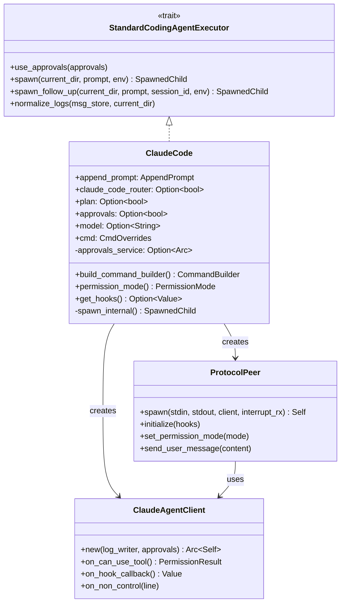

# Executor 架構與核心結構

> **文件編號**: DOC-001
> **對應任務**: [B.01] 撰寫 01-executor-architecture.md - Executor 架構與核心結構
> **原始碼位置**: `crates/executors/src/executors/claude.rs`

## 概述

Claude Code Executor 是負責啟動和管理 Claude Code CLI 程序的核心元件。它實作了 `StandardCodingAgentExecutor` trait，提供統一的介面來執行 AI 編碼代理任務。

## 模組結構

```
crates/executors/src/executors/claude/
├── mod.rs (claude.rs)   # 主要 Executor 實作
├── client.rs            # ClaudeAgentClient - 權限審批處理
├── protocol.rs          # ProtocolPeer - 雙向協議通訊
└── types.rs             # 類型定義
```

## ClaudeCode Struct 定義

**檔案位置**: `claude.rs:52-76`

```rust
#[derive(Derivative, Clone, Serialize, Deserialize, TS, JsonSchema)]
pub struct ClaudeCode {
    // 附加提示內容 - 會附加到使用者 prompt 後面
    pub append_prompt: AppendPrompt,

    // 啟用 Claude Code Router 模式
    pub claude_code_router: Option<bool>,

    // 計畫模式 - 需要使用者審批 ExitPlanMode
    pub plan: Option<bool>,

    // 啟用工具審批服務
    pub approvals: Option<bool>,

    // 覆寫使用的模型 (例如 "claude-sonnet-4-20250514")
    pub model: Option<String>,

    // 危險選項：跳過所有權限檢查
    pub dangerously_skip_permissions: Option<bool>,

    // 停用 API Key 傳遞
    pub disable_api_key: Option<bool>,

    // 命令覆寫設定
    pub cmd: CmdOverrides,

    // 審批服務實例 (執行時注入)
    approvals_service: Option<Arc<dyn ExecutorApprovalService>>,
}
```

## 欄位詳解

### append_prompt
- **類型**: `AppendPrompt`
- **用途**: 在使用者提供的 prompt 後附加額外內容
- **使用場景**: 添加系統指引、上下文資訊

### claude_code_router
- **類型**: `Option<bool>`
- **預設值**: `false`
- **用途**: 切換使用 Claude Code Router
- **Router 命令**: `npx -y @musistudio/claude-code-router@1.0.66 code`
- **標準命令**: `npx -y @anthropic-ai/claude-code@2.1.7`

### plan
- **類型**: `Option<bool>`
- **預設值**: `false`
- **用途**: 啟用計畫模式
- **行為**:
  - 設定 `PermissionMode::Plan`
  - 註冊 Hook 攔截 `ExitPlanMode` 工具使用
  - 其他工具自動審批

### approvals
- **類型**: `Option<bool>`
- **預設值**: `false`
- **用途**: 啟用工具審批服務
- **行為**:
  - 設定 `PermissionMode::Default`
  - 除了讀取類工具外，其他需要審批

### model
- **類型**: `Option<String>`
- **用途**: 覆寫預設模型
- **範例**: `"claude-sonnet-4-20250514"`

### dangerously_skip_permissions
- **類型**: `Option<bool>`
- **預設值**: `false`
- **用途**: 完全跳過權限檢查（危險！）
- **CLI 參數**: `--dangerously-skip-permissions`

### cmd
- **類型**: `CmdOverrides`
- **用途**: 命令覆寫配置
- **內容**:
  - `base_command_override`: 覆寫基礎命令
  - `additional_params`: 額外命令列參數
  - `env_vars`: 額外環境變數

## StandardCodingAgentExecutor Trait 實作

**檔案位置**: `claude.rs:160-231`

```rust
#[async_trait]
impl StandardCodingAgentExecutor for ClaudeCode {
    // 注入審批服務
    fn use_approvals(&mut self, approvals: Arc<dyn ExecutorApprovalService>);

    // 初始任務啟動
    async fn spawn(
        &self,
        current_dir: &Path,
        prompt: &str,
        env: &ExecutionEnv,
    ) -> Result<SpawnedChild, ExecutorError>;

    // Follow-up 任務啟動
    async fn spawn_follow_up(
        &self,
        current_dir: &Path,
        prompt: &str,
        session_id: &str,
        env: &ExecutionEnv,
    ) -> Result<SpawnedChild, ExecutorError>;

    // 日誌正規化處理
    fn normalize_logs(&self, msg_store: Arc<MsgStore>, current_dir: &Path);

    // MCP 配置路徑
    fn default_mcp_config_path(&self) -> Option<PathBuf>;

    // 可用性資訊
    fn get_availability_info(&self) -> AvailabilityInfo;
}
```

## Permission Mode 類型

**檔案位置**: `types.rs`

```rust
pub enum PermissionMode {
    // 預設模式 - 需要權限審批
    Default,

    // 計畫模式 - 只有 ExitPlanMode 需要審批
    Plan,

    // 繞過模式 - 自動審批所有工具
    BypassPermissions,
}
```

## Hooks 配置

### Plan 模式 Hooks

```json
{
    "PreToolUse": [
        {
            "matcher": "^ExitPlanMode$",
            "hookCallbackIds": ["tool_approval"]
        },
        {
            "matcher": "^(?!ExitPlanMode$).*",
            "hookCallbackIds": ["AUTO_APPROVE_CALLBACK_ID"]
        }
    ]
}
```

### Approvals 模式 Hooks

```json
{
    "PreToolUse": [
        {
            "matcher": "^(?!(Glob|Grep|NotebookRead|Read|Task|TodoWrite)$).*",
            "hookCallbackIds": ["tool_approval"]
        }
    ]
}
```

## 架構圖



## SpawnedChild 結構

**返回值結構**:

```rust
pub struct SpawnedChild {
    // 子程序 handle
    pub child: AsyncGroupChild,

    // 執行器結束訊號 (可選)
    pub exit_signal: Option<ExecutorExitSignal>,

    // 中斷發送器 (用於優雅關閉)
    pub interrupt_sender: Option<oneshot::Sender<()>>,
}
```

---

*上一章節: [00-overview.md](./00-overview.md) - Claude Code 執行流程總覽*
*下一章節: [02-command-building.md](./02-command-building.md) - 命令建構邏輯*
