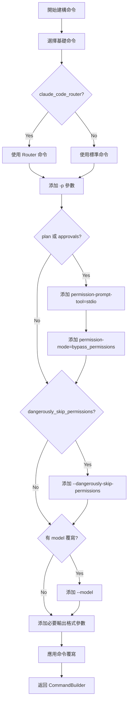

# 命令建構邏輯

> **文件編號**: DOC-001
> **對應任務**: [B.02] 撰寫 02-command-building.md - 命令建構邏輯
> **原始碼位置**: `crates/executors/src/executors/claude.rs:78-119`

## 概述

Claude Code Executor 使用 `CommandBuilder` 來組裝完整的 CLI 命令。這個過程會根據配置添加各種參數和標誌。

## 基礎命令

**檔案位置**: `claude.rs:42-48`

```rust
fn base_command(claude_code_router: bool) -> &'static str {
    if claude_code_router {
        "npx -y @musistudio/claude-code-router@1.0.66 code"
    } else {
        "npx -y @anthropic-ai/claude-code@2.1.7"
    }
}
```

| 模式 | 命令 |
|------|------|
| 標準模式 | `npx -y @anthropic-ai/claude-code@2.1.7` |
| Router 模式 | `npx -y @musistudio/claude-code-router@1.0.66 code` |

## CommandBuilder 建構流程

**檔案位置**: `claude.rs:78-119`

```rust
async fn build_command_builder(&self) -> Result<CommandBuilder, CommandBuildError> {
    // Step 1: 建立基礎命令
    let mut builder = CommandBuilder::new(base_command(self.claude_code_router.unwrap_or(false)))
        .params(["-p"]);  // 權限標誌

    // Step 2: 處理 plan/approvals 模式
    let plan = self.plan.unwrap_or(false);
    let approvals = self.approvals.unwrap_or(false);
    if plan || approvals {
        builder = builder.extend_params(["--permission-prompt-tool=stdio"]);
        builder = builder.extend_params([format!(
            "--permission-mode={}",
            PermissionMode::BypassPermissions
        )]);
    }

    // Step 3: 處理跳過權限選項
    if self.dangerously_skip_permissions.unwrap_or(false) {
        builder = builder.extend_params(["--dangerously-skip-permissions"]);
    }

    // Step 4: 處理模型覆寫
    if let Some(model) = &self.model {
        builder = builder.extend_params(["--model", model]);
    }

    // Step 5: 添加必要的輸出格式參數
    builder = builder.extend_params([
        "--verbose",
        "--output-format=stream-json",
        "--input-format=stream-json",
        "--include-partial-messages",
        "--disallowedTools=AskUserQuestion",
    ]);

    // Step 6: 應用命令覆寫
    apply_overrides(builder, &self.cmd)
}
```

## 命令參數詳解

### 必要參數

| 參數 | 說明 |
|------|------|
| `-p` | 啟用權限模式 |
| `--verbose` | 詳細輸出 |
| `--output-format=stream-json` | JSON 串流輸出格式 |
| `--input-format=stream-json` | JSON 串流輸入格式 |
| `--include-partial-messages` | 包含部分訊息 |
| `--disallowedTools=AskUserQuestion` | 禁用詢問使用者工具 |

### 條件參數

| 參數 | 條件 | 說明 |
|------|------|------|
| `--permission-prompt-tool=stdio` | plan 或 approvals 為 true | 使用 stdio 進行權限提示 |
| `--permission-mode=bypass_permissions` | plan 或 approvals 為 true | 初始設定繞過模式 |
| `--dangerously-skip-permissions` | dangerously_skip_permissions 為 true | 跳過所有權限 |
| `--model <model>` | model 有值 | 指定使用的模型 |

### Follow-up 專用參數

| 參數 | 說明 |
|------|------|
| `--fork-session` | 分叉現有會話 |
| `--resume <session_id>` | 恢復指定會話 |

## 命令建構流程圖



## CmdOverrides 結構

```rust
pub struct CmdOverrides {
    // 覆寫基礎命令
    pub base_command_override: Option<String>,

    // 額外命令列參數
    pub additional_params: Option<Vec<String>>,

    // 額外環境變數
    pub env_vars: Option<HashMap<String, String>>,
}
```

## 完整命令範例

### 標準模式 (無審批)

```bash
npx -y @anthropic-ai/claude-code@2.1.7 \
  -p \
  --verbose \
  --output-format=stream-json \
  --input-format=stream-json \
  --include-partial-messages \
  --disallowedTools=AskUserQuestion
```

### 計畫模式

```bash
npx -y @anthropic-ai/claude-code@2.1.7 \
  -p \
  --permission-prompt-tool=stdio \
  --permission-mode=bypass_permissions \
  --verbose \
  --output-format=stream-json \
  --input-format=stream-json \
  --include-partial-messages \
  --disallowedTools=AskUserQuestion
```

### Follow-up 模式

```bash
npx -y @anthropic-ai/claude-code@2.1.7 \
  -p \
  --verbose \
  --output-format=stream-json \
  --input-format=stream-json \
  --include-partial-messages \
  --disallowedTools=AskUserQuestion \
  --fork-session \
  --resume abc123-session-id
```

### 自訂模型

```bash
npx -y @anthropic-ai/claude-code@2.1.7 \
  -p \
  --model claude-sonnet-4-20250514 \
  --verbose \
  --output-format=stream-json \
  --input-format=stream-json \
  --include-partial-messages \
  --disallowedTools=AskUserQuestion
```

## 命令解析流程

```rust
// 初始命令
let command_parts = command_builder.build_initial()?;

// Follow-up 命令
let command_parts = command_builder.build_follow_up(&[
    "--fork-session".to_string(),
    "--resume".to_string(),
    session_id.to_string(),
])?;

// 解析為程式路徑和參數
let (program_path, args) = command_parts.into_resolved().await?;
```

---

*上一章節: [01-executor-architecture.md](./01-executor-architecture.md) - Executor 架構與核心結構*
*下一章節: [03-process-spawning.md](./03-process-spawning.md) - 程序生成機制*
