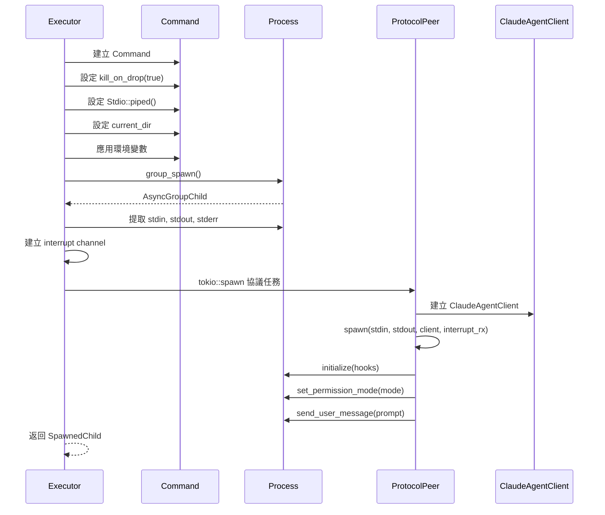
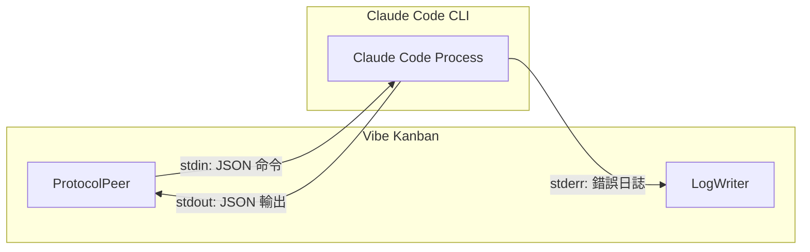
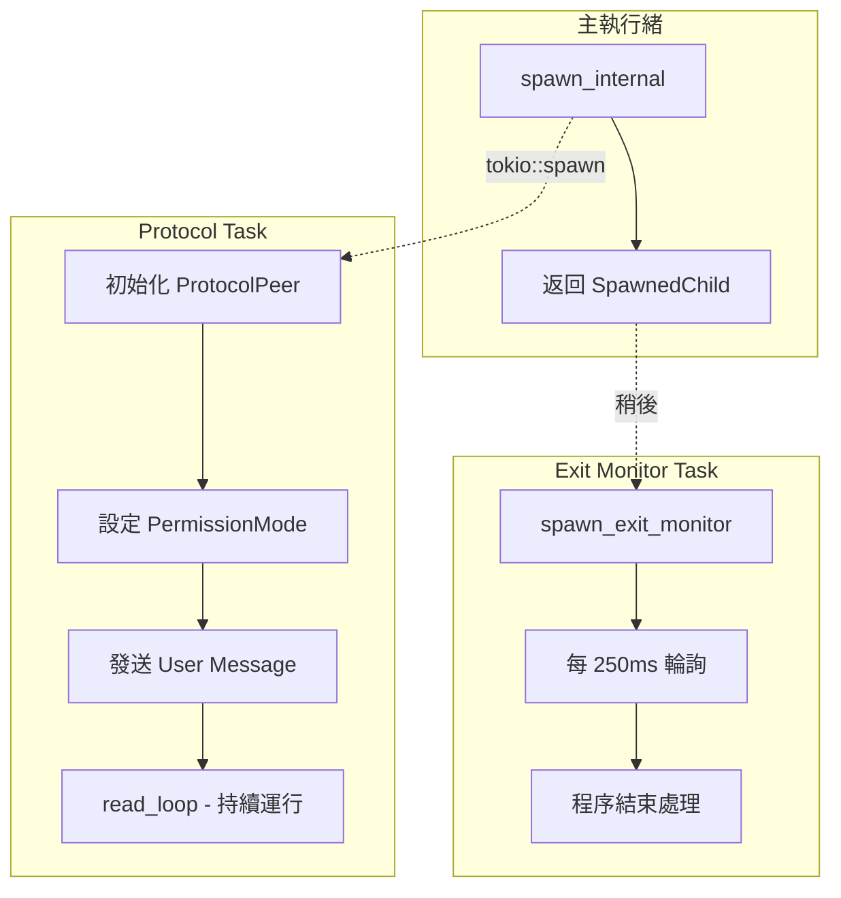

# 程序生成機制

> **文件編號**: DOC-001
> **對應任務**: [B.03] 撰寫 03-process-spawning.md - 程序生成機制
> **原始碼位置**: `crates/executors/src/executors/claude.rs:233-316`

## 概述

Claude Code Executor 使用 Tokio 異步運行時來生成和管理 Claude Code CLI 子程序。這個過程涉及程序配置、I/O 管道設定、以及協議初始化。

## spawn_internal 方法

**檔案位置**: `claude.rs:233-316`

這是核心的程序生成方法，負責：
1. 建立子程序配置
2. 設定 I/O 管道
3. 初始化協議通訊
4. 返回 SpawnedChild 結構

## 程序生成流程

### Step 1: 解析命令

```rust
let (program_path, args) = command_parts.into_resolved().await?;
let combined_prompt = self.append_prompt.combine_prompt(prompt);
```

### Step 2: 配置 Command

```rust
let mut command = Command::new(program_path);
command
    .kill_on_drop(true)      // 當 handle 被 drop 時自動終止
    .stdin(Stdio::piped())   // 管道化 stdin
    .stdout(Stdio::piped())  // 管道化 stdout
    .stderr(Stdio::piped())  // 管道化 stderr
    .current_dir(current_dir)
    .args(&args);
```

### Step 3: 應用環境變數

```rust
env.clone()
    .with_profile(&self.cmd)
    .apply_to_command(&mut command);

// 可選：移除 API Key
if self.disable_api_key.unwrap_or(false) {
    command.env_remove("ANTHROPIC_API_KEY");
}
```

### Step 4: 生成程序組

```rust
let mut child = command.group_spawn()?;
```

使用 `group_spawn()` 而非 `spawn()` 是為了能夠一次性終止整個程序組（包括子程序）。

### Step 5: 提取 I/O Handle

```rust
let child_stdout = child.inner().stdout.take().ok_or_else(|| {
    ExecutorError::Io(std::io::Error::other("Claude Code missing stdout"))
})?;
let child_stdin = child.inner().stdin.take().ok_or_else(|| {
    ExecutorError::Io(std::io::Error::other("Claude Code missing stdin"))
})?;
```

### Step 6: 建立中斷通道

```rust
let (interrupt_tx, interrupt_rx) = tokio::sync::oneshot::channel::<()>();
```

### Step 7: 啟動協議處理任務

```rust
tokio::spawn(async move {
    let log_writer = LogWriter::new(new_stdout);
    let client = ClaudeAgentClient::new(log_writer.clone(), approvals_clone);
    let protocol_peer = ProtocolPeer::spawn(
        child_stdin,
        child_stdout,
        client.clone(),
        interrupt_rx
    );

    // 初始化控制協議
    if let Err(e) = protocol_peer.initialize(hooks).await {
        tracing::error!("Failed to initialize control protocol: {e}");
        return;
    }

    // 設定權限模式
    if let Err(e) = protocol_peer.set_permission_mode(permission_mode).await {
        tracing::warn!("Failed to set permission mode: {e}");
    }

    // 發送使用者訊息
    if let Err(e) = protocol_peer.send_user_message(prompt_clone).await {
        tracing::error!("Failed to send prompt: {e}");
    }
});
```

## 程序生成流程圖



## I/O 管道架構



## SpawnedChild 結構

```rust
pub struct SpawnedChild {
    /// 子程序 handle - AsyncGroupChild 支援程序組操作
    pub child: AsyncGroupChild,

    /// 執行器結束訊號 (可選)
    /// 用於執行器主動通知完成
    pub exit_signal: Option<ExecutorExitSignal>,

    /// 中斷發送器 (用於優雅關閉)
    /// 發送後會觸發 ProtocolPeer 發送中斷命令
    pub interrupt_sender: Option<oneshot::Sender<()>>,
}
```

## 關鍵配置說明

### kill_on_drop(true)

當 `AsyncGroupChild` handle 被 drop 時，會自動發送 SIGKILL 終止整個程序組。這確保了：
- 資源不會洩漏
- 孤兒程序不會殘留

### group_spawn()

使用 `command_group` crate 的 `group_spawn()` 方法：
- 建立新的程序組
- 子程序也在同一程序組中
- 可以一次性終止整個程序組

### Stdio::piped()

三個標準 I/O 都設定為 pipe 模式：
- **stdin**: 用於發送 JSON 命令到 Claude Code
- **stdout**: 用於接收 Claude Code 的 JSON 輸出
- **stderr**: 用於接收錯誤和日誌訊息

## 異步任務架構



## 錯誤處理

### 程序生成失敗

```rust
match command.group_spawn() {
    Ok(child) => { /* 繼續處理 */ }
    Err(e) => return Err(ExecutorError::Io(e)),
}
```

### I/O Handle 缺失

```rust
let child_stdout = child.inner().stdout.take().ok_or_else(|| {
    ExecutorError::Io(std::io::Error::other("Claude Code missing stdout"))
})?;
```

### 協議初始化失敗

```rust
if let Err(e) = protocol_peer.initialize(hooks).await {
    tracing::error!("Failed to initialize control protocol: {e}");
    let _ = log_writer
        .log_raw(&format!("Error: Failed to initialize - {e}"))
        .await;
    return;
}
```

---

*上一章節: [02-command-building.md](./02-command-building.md) - 命令建構邏輯*
*下一章節: [04-protocol-handling.md](./04-protocol-handling.md) - 協議處理與雙向通訊*
