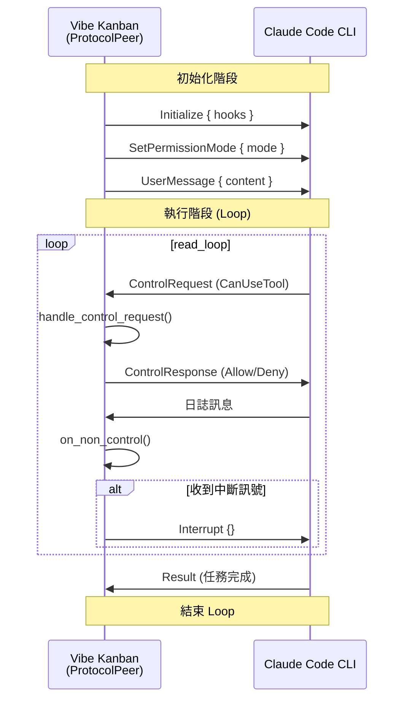
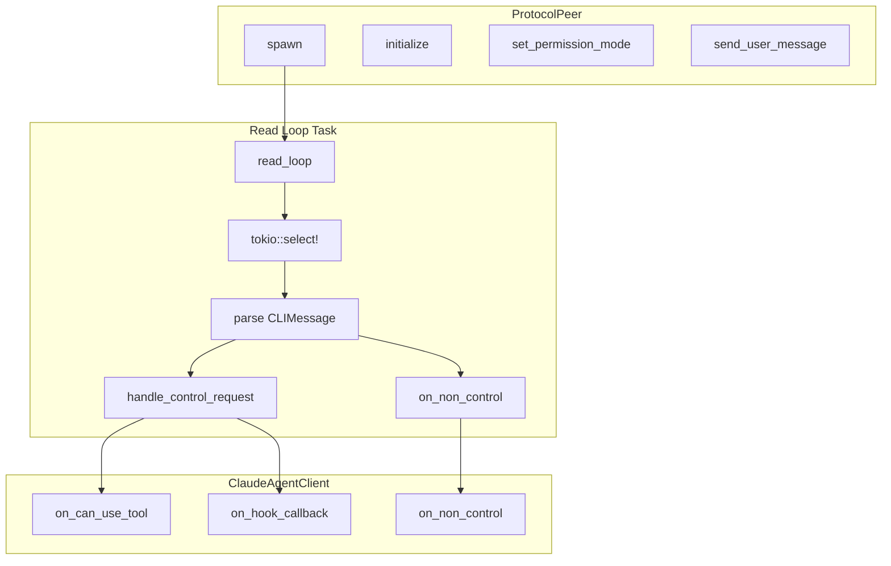

# 協議處理與雙向通訊

> **文件編號**: DOC-001
> **對應任務**: [C.01] 撰寫 04-protocol-handling.md - 協議處理與雙向通訊
> **原始碼位置**: `crates/executors/src/executors/claude/protocol.rs`

## 概述

ProtocolPeer 是負責處理 Vibe Kanban 與 Claude Code CLI 之間雙向 JSON 通訊的核心元件。它透過 stdin/stdout 管道與 Claude Code 程序交換控制訊息。

## ProtocolPeer 結構

**檔案位置**: `protocol.rs:19-23`

```rust
/// 處理雙向控制協議通訊
#[derive(Clone)]
pub struct ProtocolPeer {
    stdin: Arc<Mutex<ChildStdin>>,
}
```

## 主要方法

### spawn() - 建立協議通訊

**檔案位置**: `protocol.rs:26-44`

```rust
pub fn spawn(
    stdin: ChildStdin,
    stdout: ChildStdout,
    client: Arc<ClaudeAgentClient>,
    interrupt_rx: oneshot::Receiver<()>,
) -> Self {
    let peer = Self {
        stdin: Arc::new(Mutex::new(stdin)),
    };

    let reader_peer = peer.clone();
    tokio::spawn(async move {
        if let Err(e) = reader_peer.read_loop(stdout, client, interrupt_rx).await {
            tracing::error!("Protocol reader loop error: {}", e);
        }
    });

    peer
}
```

### initialize() - 初始化控制協議

**檔案位置**: `protocol.rs:197-202`

```rust
pub async fn initialize(&self, hooks: Option<serde_json::Value>) -> Result<(), ExecutorError> {
    self.send_json(&SDKControlRequest::new(SDKControlRequestType::Initialize {
        hooks,
    }))
    .await
}
```

### set_permission_mode() - 設定權限模式

**檔案位置**: `protocol.rs:208-213`

```rust
pub async fn set_permission_mode(&self, mode: PermissionMode) -> Result<(), ExecutorError> {
    self.send_json(&SDKControlRequest::new(
        SDKControlRequestType::SetPermissionMode { mode },
    ))
    .await
}
```

### send_user_message() - 發送使用者訊息

**檔案位置**: `protocol.rs:192-195`

```rust
pub async fn send_user_message(&self, content: String) -> Result<(), ExecutorError> {
    let message = Message::new_user(content);
    self.send_json(&message).await
}
```

### interrupt() - 發送中斷訊號

**檔案位置**: `protocol.rs:203-206`

```rust
pub async fn interrupt(&self) -> Result<(), ExecutorError> {
    self.send_json(&SDKControlRequest::new(SDKControlRequestType::Interrupt {}))
        .await
}
```

## 訊息類型

### CLIMessage (從 Claude Code 接收)

```rust
pub enum CLIMessage {
    // 控制請求 - 需要審批工具使用
    ControlRequest {
        request_id: String,
        request: ControlRequestType,
    },

    // 控制回應
    ControlResponse { ... },

    // 最終結果 - 任務完成
    Result(serde_json::Value),

    // 其他訊息 - 日誌等
    // (透過 serde untagged 捕獲)
}
```

### ControlRequestType (請求類型)

```rust
pub enum ControlRequestType {
    // 工具使用權限請求
    CanUseTool {
        tool_name: String,
        input: serde_json::Value,
        permission_suggestions: Option<Vec<PermissionUpdate>>,
        blocked_paths: Option<Vec<String>>,
        tool_use_id: Option<String>,
    },

    // Hook 回調
    HookCallback {
        callback_id: String,
        input: serde_json::Value,
        tool_use_id: Option<String>,
    },
}
```

### SDKControlRequest (發送到 Claude Code)

```rust
pub enum SDKControlRequestType {
    // 初始化
    Initialize { hooks: Option<serde_json::Value> },

    // 設定權限模式
    SetPermissionMode { mode: PermissionMode },

    // 中斷執行
    Interrupt {},
}
```

## 通訊流程圖



## handle_control_request 處理

**檔案位置**: `protocol.rs:103-160`

```rust
async fn handle_control_request(
    &self,
    client: &Arc<ClaudeAgentClient>,
    request_id: String,
    request: ControlRequestType,
) {
    match request {
        ControlRequestType::CanUseTool { tool_name, input, ... } => {
            // 呼叫 client 處理工具審批
            match client.on_can_use_tool(tool_name, input, ...).await {
                Ok(result) => {
                    self.send_hook_response(request_id, result).await;
                }
                Err(e) => {
                    self.send_error(request_id, e.to_string()).await;
                }
            }
        }

        ControlRequestType::HookCallback { callback_id, input, ... } => {
            // 呼叫 client 處理 Hook 回調
            match client.on_hook_callback(callback_id, input, ...).await {
                Ok(hook_output) => {
                    self.send_hook_response(request_id, hook_output).await;
                }
                Err(e) => {
                    self.send_error(request_id, e.to_string()).await;
                }
            }
        }
    }
}
```

## JSON 通訊格式

### 發送訊息

```rust
async fn send_json<T: serde::Serialize>(&self, message: &T) -> Result<(), ExecutorError> {
    let json = serde_json::to_string(message)?;
    let mut stdin = self.stdin.lock().await;
    stdin.write_all(json.as_bytes()).await?;
    stdin.write_all(b"\n").await?;  // 每行一個 JSON
    stdin.flush().await?;
    Ok(())
}
```

### 接收訊息

```rust
// 在 read_loop 中
let mut reader = BufReader::new(stdout);
let mut buffer = String::new();

loop {
    buffer.clear();
    match reader.read_line(&mut buffer).await {
        Ok(0) => break,  // EOF
        Ok(_) => {
            let line = buffer.trim();
            if line.is_empty() { continue; }

            // 解析 JSON
            match serde_json::from_str::<CLIMessage>(line) {
                Ok(msg) => { /* 處理訊息 */ }
                Err(_) => { /* 非控制訊息 */ }
            }
        }
        Err(e) => break,
    }
}
```

## 權限回應格式

### PermissionResult

```rust
pub enum PermissionResult {
    // 允許工具使用
    Allow {
        updated_input: serde_json::Value,
        updated_permissions: Option<Vec<PermissionUpdate>>,
    },

    // 拒絕工具使用
    Deny {
        message: String,
        interrupt: Option<bool>,
    },
}
```

### ControlResponseType

```rust
pub enum ControlResponseType {
    Success {
        request_id: String,
        response: Option<serde_json::Value>,
    },
    Error {
        request_id: String,
        error: Option<String>,
    },
}
```

## 異步處理架構



---

*上一章節: [03-process-spawning.md](./03-process-spawning.md) - 程序生成機制*
*下一章節: [05-loop-mechanism.md](./05-loop-mechanism.md) - Loop 循環機制詳解*
