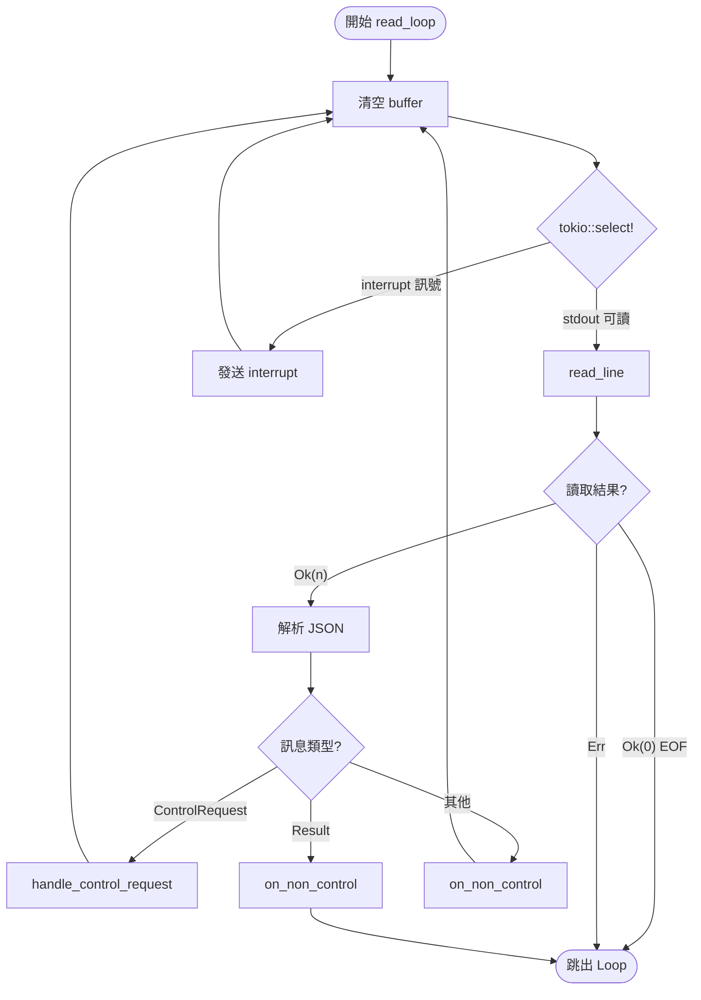
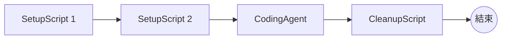
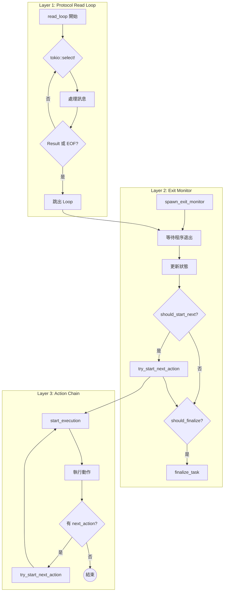
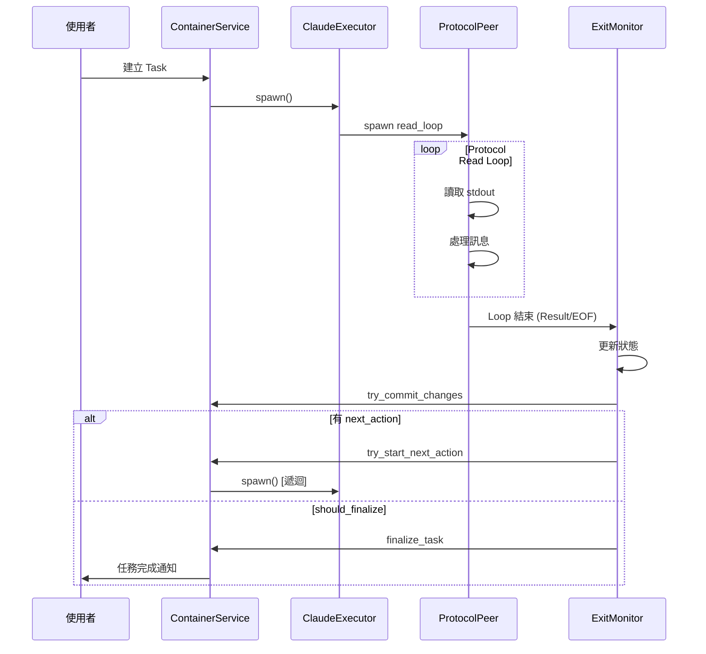

# Loop 循環機制詳解

> **文件編號**: DOC-001
> **對應任務**: [C.02] 撰寫 05-loop-mechanism.md - Loop 循環機制詳解
> **原始碼位置**: 多個檔案

## 概述

**核心問題答案: 是的，系統確實有啟用 Loop 循環機制，直到任務完成。**

Vibe Kanban 透過三層 Loop 機制確保任務持續執行直到完成：

1. **Protocol Read Loop** - 協議層持續讀取
2. **ExecutorAction Chain** - 動作鏈式執行
3. **Exit Monitor Loop** - 程序退出監控

## 第一層: Protocol Read Loop

**檔案位置**: `protocol.rs:46-101`

這是最內層的 Loop，負責持續讀取 Claude Code 的輸出。

### 程式碼分析

```rust
async fn read_loop(
    &self,
    stdout: ChildStdout,
    client: Arc<ClaudeAgentClient>,
    interrupt_rx: oneshot::Receiver<()>,
) -> Result<(), ExecutorError> {
    let mut reader = BufReader::new(stdout);
    let mut buffer = String::new();
    let mut interrupt_rx = interrupt_rx.fuse();

    loop {  // <-- 主要 Loop
        buffer.clear();
        tokio::select! {
            // 分支 1: 讀取 stdout
            line_result = reader.read_line(&mut buffer) => {
                match line_result {
                    Ok(0) => break,  // EOF - 跳出 Loop
                    Ok(_) => {
                        let line = buffer.trim();
                        if line.is_empty() { continue; }

                        match serde_json::from_str::<CLIMessage>(line) {
                            Ok(CLIMessage::ControlRequest { .. }) => {
                                self.handle_control_request(...).await;
                            }
                            Ok(CLIMessage::Result(_)) => {
                                client.on_non_control(line).await?;
                                break;  // Result - 跳出 Loop
                            }
                            _ => {
                                client.on_non_control(line).await?;
                            }
                        }
                    }
                    Err(e) => break,  // 錯誤 - 跳出 Loop
                }
            }

            // 分支 2: 中斷訊號
            _ = &mut interrupt_rx => {
                self.interrupt().await?;
            }
        }
    }
    Ok(())
}
```

### Loop 終止條件

| 條件 | 說明 |
|------|------|
| `Ok(0)` | EOF - 程序結束 |
| `CLIMessage::Result` | 收到結果訊息 - 任務完成 |
| `Err(e)` | 讀取錯誤 |

### 流程圖



## 第二層: ExecutorAction Chain

**檔案位置**: `container.rs:1165-1198`

這是動作鏈層的 Loop，透過 `next_action` 指標實現鏈式執行。

### 程式碼分析

```rust
async fn try_start_next_action(&self, ctx: &ExecutionContext) -> Result<(), ContainerError> {
    let action = ctx.execution_process.executor_action()?;

    // 取得下一個動作
    let next_action = if let Some(next_action) = action.next_action() {
        next_action
    } else {
        tracing::debug!("No next action configured");
        return Ok(());  // 沒有下一個動作 - 結束鏈
    };

    // 決定下一個動作的執行原因
    let next_run_reason = match (action.typ(), next_action.typ()) {
        // Script -> Script: SetupScript
        (ScriptRequest(_), ScriptRequest(_)) => SetupScript,
        // CodingAgent -> Script: CleanupScript
        (CodingAgent..., ScriptRequest(_)) => CleanupScript,
        // Any -> CodingAgent: CodingAgent
        (_, CodingAgent...) => CodingAgent,
    };

    // 遞迴呼叫 start_execution
    self.start_execution(&ctx.workspace, &ctx.session, next_action, &next_run_reason)
        .await?;

    Ok(())
}
```

### ExecutorAction 結構

```rust
pub struct ExecutorAction {
    // 當前動作類型
    action_type: ExecutorActionType,

    // 下一個動作 (可選) - 實現鏈式結構
    next_action: Option<Box<ExecutorAction>>,
}

pub enum ExecutorActionType {
    CodingAgentInitialRequest(CodingAgentInitialRequest),
    CodingAgentFollowUpRequest(CodingAgentFollowUpRequest),
    ScriptRequest(ScriptRequest),
    ReviewRequest(ReviewRequest),
}
```

### 動作鏈範例



## 第三層: Exit Monitor Loop

**檔案位置**: `local-deployment/container.rs:344-563`

這是最外層的 Loop，負責監控程序退出並觸發後續動作。

### spawn_exit_monitor()

```rust
pub fn spawn_exit_monitor(
    &self,
    exec_id: &Uuid,
    exit_signal: Option<ExecutorExitSignal>,
) -> JoinHandle<()> {
    let mut process_exit_rx = self.spawn_os_exit_watcher(exec_id);

    tokio::spawn(async move {
        // 等待程序退出
        tokio::select! {
            exit_result = &mut exit_signal_future => {
                // 執行器主動結束
                command::kill_process_group(&mut child).await;
            }
            exit_status_result = &mut process_exit_rx => {
                // OS 程序退出
            }
        }

        // 更新狀態
        ExecutionProcess::update_completion(...).await;

        // 嘗試提交變更
        let changes_committed = container.try_commit_changes(&ctx).await;

        // 嘗試啟動下一個動作
        if should_start_next {
            container.try_start_next_action(&ctx).await;  // <-- 鏈式呼叫
        }

        // 判斷是否應該結束
        if container.should_finalize(&ctx) {
            // 處理排隊的訊息
            if let Some(queued_msg) = queued_message_service.take_queued(...) {
                container.start_queued_follow_up(&ctx, &queued_msg).await;
            } else {
                container.finalize_task(...).await;
            }
        }
    })
}
```

### spawn_os_exit_watcher()

```rust
pub fn spawn_os_exit_watcher(&self, exec_id: Uuid) -> Receiver<Result<ExitStatus>> {
    let (tx, rx) = tokio::sync::oneshot::channel();

    tokio::spawn(async move {
        loop {  // <-- 輪詢 Loop
            if let Some(child_lock) = child_store.get(&exec_id) {
                match child_handler.try_wait() {
                    Ok(Some(status)) => {
                        tx.send(Ok(status));
                        break;  // 程序已退出
                    }
                    Ok(None) => {}  // 還在運行
                    Err(e) => {
                        tx.send(Err(e));
                        break;
                    }
                }
            } else {
                tx.send(Err(...));
                break;
            }

            // 每 250ms 輪詢一次
            tokio::time::sleep(Duration::from_millis(250)).await;
        }
    });

    rx
}
```

## should_finalize() 判斷

**檔案位置**: `container.rs:133-164`

決定任務是否應該結束的關鍵邏輯：

```rust
fn should_finalize(&self, ctx: &ExecutionContext) -> bool {
    // 規則 1: DevServer 永不結束
    if ctx.execution_process.run_reason == DevServer {
        return false;
    }

    // 規則 2: 平行模式的 SetupScript 不結束
    if ctx.execution_process.run_reason == SetupScript
        && action.next_action.is_none() {
        return false;
    }

    // 規則 3: 失敗或被殺 - 總是結束
    if ctx.execution_process.status == Failed || Killed {
        return true;
    }

    // 規則 4: 沒有下一個動作 - 結束
    action.next_action.is_none()
}
```

## 三層 Loop 整合圖



## 完整執行生命週期



---

*上一章節: [04-protocol-handling.md](./04-protocol-handling.md) - 協議處理與雙向通訊*
*下一章節: [06-approval-service.md](./06-approval-service.md) - 權限審批服務*
