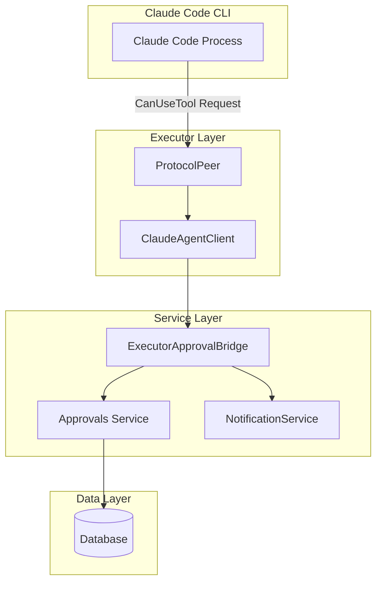
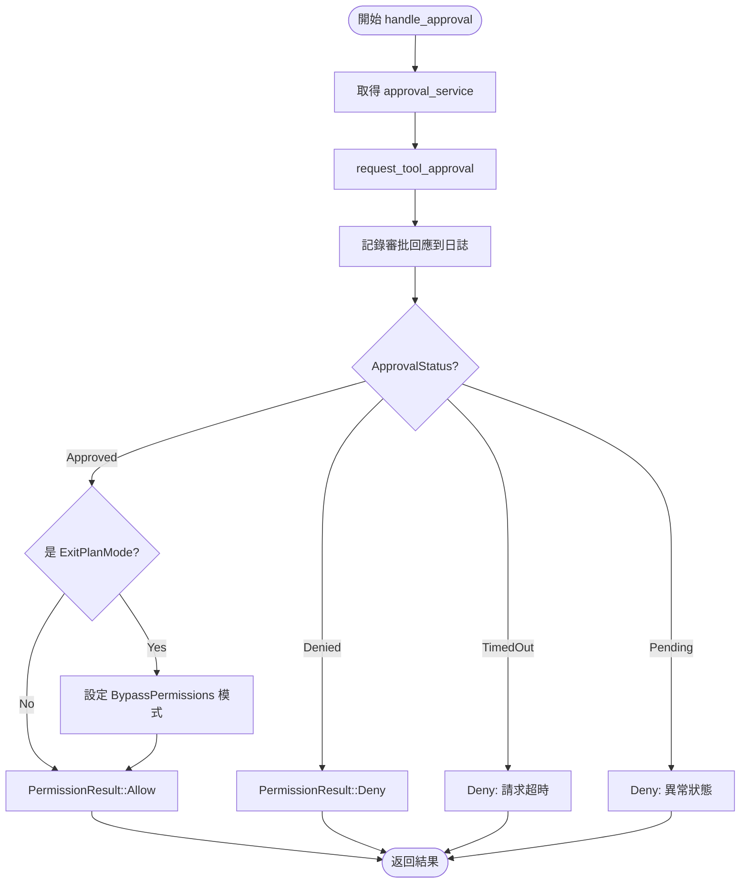
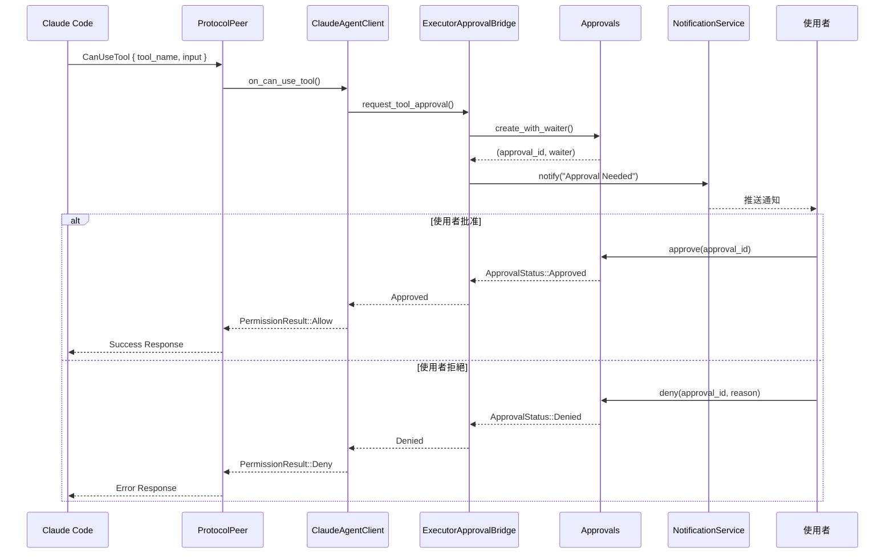

# 權限審批服務

> **文件編號**: DOC-001
> **對應任務**: [D.01] 撰寫 06-approval-service.md - 權限審批服務
> **原始碼位置**:
> - `crates/executors/src/approvals.rs`
> - `crates/executors/src/executors/claude/client.rs`
> - `crates/services/src/services/approvals/executor_approvals.rs`

## 概述

權限審批服務 (Approval Service) 是 Vibe Kanban 控制 Claude Code 工具使用權限的核心機制。當 Claude Code 請求使用工具時，此服務決定是否允許執行。

## 架構層級



## ExecutorApprovalService Trait

**檔案位置**: `approvals.rs:27-36`

```rust
#[async_trait]
pub trait ExecutorApprovalService: Send + Sync {
    /// 請求工具使用權限並等待最終決定
    async fn request_tool_approval(
        &self,
        tool_name: &str,
        tool_input: Value,
        tool_call_id: &str,
    ) -> Result<ApprovalStatus, ExecutorApprovalError>;
}
```

## ApprovalStatus 狀態

```rust
pub enum ApprovalStatus {
    Approved,           // 允許執行
    Denied { reason },  // 拒絕執行
    TimedOut,          // 請求超時
    Pending,           // 等待中 (異常狀態)
}
```

## ClaudeAgentClient 審批處理

**檔案位置**: `client.rs:45-115`

### on_can_use_tool() 方法

```rust
pub async fn on_can_use_tool(
    &self,
    tool_name: String,
    input: serde_json::Value,
    _permission_suggestions: Option<Vec<PermissionUpdate>>,
    tool_use_id: Option<String>,
) -> Result<PermissionResult, ExecutorError> {
    if self.auto_approve {
        // 無審批服務時自動允許
        Ok(PermissionResult::Allow { updated_input: input, updated_permissions: None })
    } else if let Some(latest_tool_use_id) = tool_use_id {
        // 呼叫審批服務
        self.handle_approval(latest_tool_use_id, tool_name, input).await
    } else {
        // 無 tool_use_id 時自動允許
        Ok(PermissionResult::Allow { updated_input: input, updated_permissions: None })
    }
}
```

### handle_approval() 處理流程



## ExitPlanMode 特殊處理

當審批的工具是 `ExitPlanMode` 時，除了允許執行外，還會更新權限模式：

```rust
if tool_name == EXIT_PLAN_MODE_NAME {
    Ok(PermissionResult::Allow {
        updated_input: tool_input,
        updated_permissions: Some(vec![PermissionUpdate {
            update_type: PermissionUpdateType::SetMode,
            mode: Some(PermissionMode::BypassPermissions),
            destination: Some(PermissionUpdateDestination::Session),
            rules: None,
            behavior: None,
            directories: None,
        }]),
    })
}
```

## ExecutorApprovalBridge 實作

**檔案位置**: `executor_approvals.rs:12-82`

這是連接 Executor 層和 Service 層的橋接實作：

```rust
pub struct ExecutorApprovalBridge {
    approvals: Approvals,               // 審批服務
    db: DBService,                      // 資料庫服務
    notification_service: NotificationService,  // 通知服務
    execution_process_id: Uuid,         // 執行程序 ID
}
```

### request_tool_approval() 實作

```rust
async fn request_tool_approval(
    &self,
    tool_name: &str,
    tool_input: Value,
    tool_call_id: &str,
) -> Result<ApprovalStatus, ExecutorApprovalError> {
    // Step 1: 確保任務處於 Review 狀態
    ensure_task_in_review(&self.db.pool, self.execution_process_id).await;

    // Step 2: 建立審批請求
    let request = ApprovalRequest::from_create(
        CreateApprovalRequest {
            tool_name: tool_name.to_string(),
            tool_input,
            tool_call_id: tool_call_id.to_string(),
        },
        self.execution_process_id,
    );

    // Step 3: 建立審批並取得等待器
    let (_, waiter) = self.approvals
        .create_with_waiter(request)
        .await?;

    // Step 4: 發送通知
    self.notification_service
        .notify(
            &format!("Approval Needed: {}", task_name),
            &format!("Tool '{}' requires approval", tool_name),
        )
        .await;

    // Step 5: 等待審批結果
    let status = waiter.await;
    Ok(status)
}
```

## Hook Callback 處理

**檔案位置**: `client.rs:146-183`

```rust
pub async fn on_hook_callback(
    &self,
    callback_id: String,
    _input: serde_json::Value,
    _tool_use_id: Option<String>,
) -> Result<serde_json::Value, ExecutorError> {
    if self.auto_approve {
        // 自動審批模式
        Ok(json!({
            "hookSpecificOutput": {
                "hookEventName": "PreToolUse",
                "permissionDecision": "allow",
                "permissionDecisionReason": "Auto-approved by SDK"
            }
        }))
    } else {
        match callback_id.as_str() {
            AUTO_APPROVE_CALLBACK_ID => {
                // 預設自動審批
                Ok(json!({ ... "permissionDecision": "allow" ... }))
            }
            _ => {
                // 轉發給 can_use_tool 處理
                Ok(json!({ ... "permissionDecision": "ask" ... }))
            }
        }
    }
}
```

## PermissionResult 回應格式

```rust
pub enum PermissionResult {
    // 允許工具使用
    Allow {
        updated_input: serde_json::Value,
        updated_permissions: Option<Vec<PermissionUpdate>>,
    },

    // 拒絕工具使用
    Deny {
        message: String,
        interrupt: Option<bool>,  // 是否中斷執行
    },
}
```

## NoopExecutorApprovalService

用於無需審批的場景：

```rust
#[derive(Debug, Default)]
pub struct NoopExecutorApprovalService;

#[async_trait]
impl ExecutorApprovalService for NoopExecutorApprovalService {
    async fn request_tool_approval(...) -> Result<ApprovalStatus, ExecutorApprovalError> {
        Ok(ApprovalStatus::Approved)  // 總是允許
    }
}
```

## 審批流程時序圖



---

*上一章節: [05-loop-mechanism.md](./05-loop-mechanism.md) - Loop 循環機制詳解*
*下一章節: [07-task-execution-flow.md](./07-task-execution-flow.md) - 任務執行流程*
