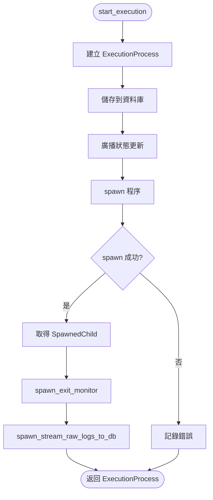
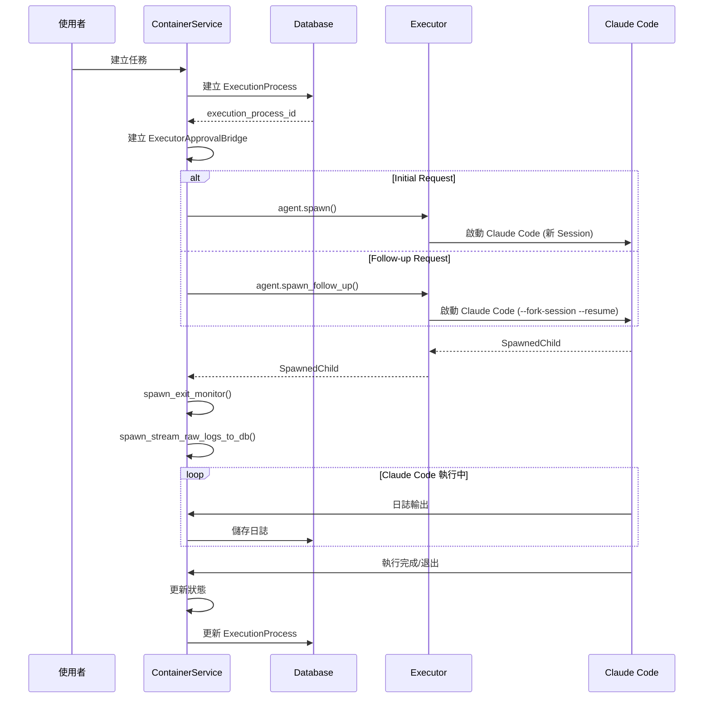

# 任務執行流程

> **文件編號**: DOC-001
> **對應任務**: [D.02] 撰寫 07-task-execution-flow.md - 任務執行流程
> **原始碼位置**:
> - `crates/executors/src/actions/coding_agent_initial.rs`
> - `crates/executors/src/actions/coding_agent_follow_up.rs`
> - `crates/services/src/services/container.rs`

## 概述

任務執行流程描述了從使用者建立任務到 Claude Code 執行完成的完整路徑。這包括初始請求 (Initial) 和後續請求 (Follow-up) 兩種模式。

## Executable Trait

**檔案位置**: `actions/mod.rs`

所有可執行動作都實作此 trait：

```rust
#[async_trait]
pub trait Executable {
    async fn spawn(
        &self,
        current_dir: &Path,
        approvals: Arc<dyn ExecutorApprovalService>,
        env: &ExecutionEnv,
    ) -> Result<SpawnedChild, ExecutorError>;
}
```

## CodingAgentInitialRequest

**檔案位置**: `coding_agent_initial.rs:17-28`

初始請求的資料結構：

```rust
#[derive(Debug, Clone, Serialize, Deserialize, PartialEq, TS)]
pub struct CodingAgentInitialRequest {
    /// 使用者提示內容
    pub prompt: String,

    /// 執行器配置檔 ID
    pub executor_profile_id: ExecutorProfileId,

    /// 可選的相對工作目錄
    pub working_dir: Option<String>,
}
```

### 方法說明

| 方法 | 說明 |
|------|------|
| `base_executor()` | 取得基礎執行器類型 |
| `effective_dir()` | 計算有效工作目錄 |

### spawn() 實作

```rust
async fn spawn(
    &self,
    current_dir: &Path,
    approvals: Arc<dyn ExecutorApprovalService>,
    env: &ExecutionEnv,
) -> Result<SpawnedChild, ExecutorError> {
    let effective_dir = self.effective_dir(current_dir);

    // 從配置取得執行器
    let mut agent = ExecutorConfigs::get_cached()
        .get_coding_agent(&self.executor_profile_id)?;

    // 注入審批服務
    agent.use_approvals(approvals.clone());

    // 生成程序
    agent.spawn(&effective_dir, &self.prompt, env).await
}
```

## CodingAgentFollowUpRequest

**檔案位置**: `coding_agent_follow_up.rs:17-29`

後續請求的資料結構：

```rust
#[derive(Debug, Clone, Serialize, Deserialize, PartialEq, TS)]
pub struct CodingAgentFollowUpRequest {
    /// 使用者提示內容
    pub prompt: String,

    /// Session ID (用於恢復會話)
    pub session_id: String,

    /// 執行器配置檔 ID
    pub executor_profile_id: ExecutorProfileId,

    /// 可選的相對工作目錄
    pub working_dir: Option<String>,
}
```

### spawn() 實作

```rust
async fn spawn(
    &self,
    current_dir: &Path,
    approvals: Arc<dyn ExecutorApprovalService>,
    env: &ExecutionEnv,
) -> Result<SpawnedChild, ExecutorError> {
    let effective_dir = self.effective_dir(current_dir);

    let mut agent = ExecutorConfigs::get_cached()
        .get_coding_agent(&self.executor_profile_id)?;

    agent.use_approvals(approvals.clone());

    // 使用 spawn_follow_up 恢復會話
    agent.spawn_follow_up(&effective_dir, &self.prompt, &self.session_id, env).await
}
```

## Initial vs Follow-up 差異

| 特性 | Initial Request | Follow-up Request |
|------|-----------------|-------------------|
| Session | 建立新 Session | 恢復現有 Session |
| CLI 參數 | 標準參數 | `--fork-session --resume` |
| 上下文 | 無歷史 | 保留歷史對話 |
| 使用場景 | 新任務 | 繼續或修正任務 |

## ContainerService start_execution()

**檔案位置**: `container.rs:966-1163`

這是任務執行的入口點：



### 關鍵步驟

1. **建立 ExecutionProcess**
```rust
let execution_process = ExecutionProcess::create(
    &self.db().pool,
    CreateExecutionProcess {
        workspace_session_id: session.id,
        executor_action: executor_action.clone(),
        run_reason: run_reason.clone(),
    },
).await?;
```

2. **廣播狀態更新**
```rust
self.pubsub_tx()
    .send(SubEvent::ExecutionProcess { event })
    .await?;
```

3. **Spawn 執行器**
```rust
let spawned = executor_action
    .typ()
    .spawn(&workspace_root, approvals, &env)
    .await?;
```

4. **啟動監控**
```rust
self.spawn_exit_monitor(&execution_process.id, spawned.exit_signal);
```

## ExecutionContext 結構

```rust
pub struct ExecutionContext {
    pub workspace: Workspace,
    pub session: WorkspaceSession,
    pub execution_process: ExecutionProcess,
}
```

## 執行流程時序圖



## 日誌正規化

**檔案位置**: `container.rs:1121-1159`

執行過程中的日誌會被正規化處理：

```rust
if let Some(msg_store) = self.get_msg_store_by_id(&execution_process.id).await {
    if let Some(executor) = ExecutorConfigs::get_cached()
        .get_coding_agent(executor_profile_id) {
        executor.normalize_logs(msg_store, &working_dir);
    }
}
```

## QA 模式

在測試環境中，使用模擬執行器：

```rust
#[cfg(feature = "qa-mode")]
{
    tracing::info!("QA mode: using mock executor instead of real agent");
    let executor = crate::executors::qa_mock::QaMockExecutor;
    return executor.spawn(&effective_dir, &self.prompt, env).await;
}
```

---

*上一章節: [06-approval-service.md](./06-approval-service.md) - 權限審批服務*
*下一章節: [08-next-action-chain.md](./08-next-action-chain.md) - NextAction 鏈式執行機制*
