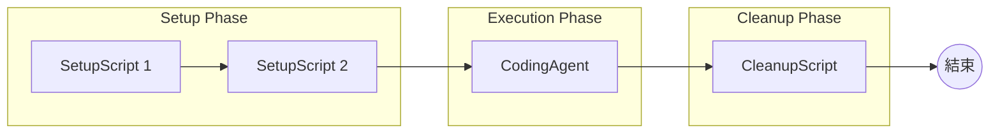
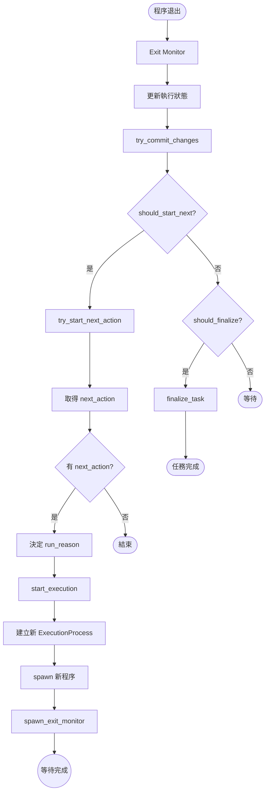
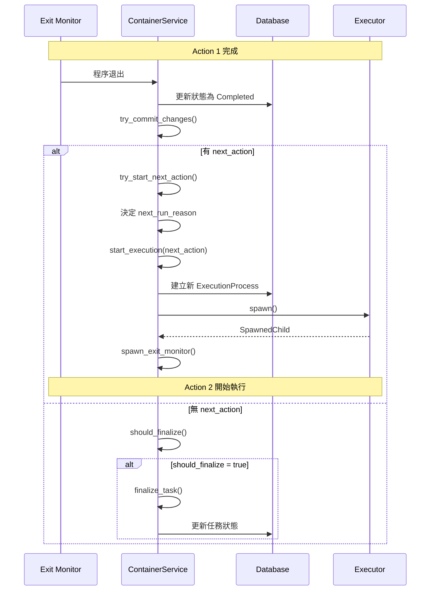

# NextAction 鏈式執行機制

> **文件編號**: DOC-001
> **對應任務**: [D.03] 撰寫 08-next-action-chain.md - NextAction 鏈式執行機制
> **原始碼位置**: `crates/services/src/services/container.rs:1165-1198`

## 概述

NextAction 鏈式執行機制允許多個執行動作按順序執行，形成一個動作鏈。這使得複雜的工作流程可以被分解為多個步驟，每個步驟完成後自動觸發下一個步驟。

## ExecutorAction 結構

```rust
pub struct ExecutorAction {
    /// 當前動作類型
    action_type: ExecutorActionType,

    /// 下一個動作 (可選) - 實現鏈式結構
    next_action: Option<Box<ExecutorAction>>,
}
```

## ExecutorActionType 類型

```rust
pub enum ExecutorActionType {
    /// 初始編碼任務
    CodingAgentInitialRequest(CodingAgentInitialRequest),

    /// 後續編碼任務
    CodingAgentFollowUpRequest(CodingAgentFollowUpRequest),

    /// 腳本執行請求
    ScriptRequest(ScriptRequest),

    /// 程式碼審查請求
    ReviewRequest(ReviewRequest),
}
```

## 動作鏈範例



## try_start_next_action() 方法

**檔案位置**: `container.rs:1165-1198`

```rust
async fn try_start_next_action(&self, ctx: &ExecutionContext) -> Result<(), ContainerError> {
    // Step 1: 取得當前動作
    let action = ctx.execution_process.executor_action()?;

    // Step 2: 檢查是否有下一個動作
    let next_action = if let Some(next_action) = action.next_action() {
        next_action
    } else {
        tracing::debug!("No next action configured");
        return Ok(());  // 沒有下一個動作，結束鏈
    };

    // Step 3: 決定下一個動作的執行原因
    let next_run_reason = match (action.typ(), next_action.typ()) {
        // Script -> Script = SetupScript
        (ScriptRequest(_), ScriptRequest(_)) => {
            ExecutionProcessRunReason::SetupScript
        }
        // CodingAgent/Review -> Script = CleanupScript
        (CodingAgentInitialRequest(_) | CodingAgentFollowUpRequest(_) | ReviewRequest(_),
         ScriptRequest(_)) => {
            ExecutionProcessRunReason::CleanupScript
        }
        // Any -> CodingAgent/Review = CodingAgent
        (_, CodingAgentFollowUpRequest(_) | CodingAgentInitialRequest(_) | ReviewRequest(_)) => {
            ExecutionProcessRunReason::CodingAgent
        }
    };

    // Step 4: 遞迴呼叫 start_execution
    self.start_execution(&ctx.workspace, &ctx.session, next_action, &next_run_reason)
        .await?;

    tracing::debug!("Started next action: {:?}", next_action);
    Ok(())
}
```

## ExecutionProcessRunReason

```rust
pub enum ExecutionProcessRunReason {
    /// 初始設定腳本
    SetupScript,

    /// 主要編碼任務
    CodingAgent,

    /// 清理腳本
    CleanupScript,

    /// 開發伺服器
    DevServer,
}
```

## 動作轉換規則

| 當前動作 | 下一動作 | 執行原因 |
|----------|----------|----------|
| ScriptRequest | ScriptRequest | SetupScript |
| CodingAgentInitialRequest | ScriptRequest | CleanupScript |
| CodingAgentFollowUpRequest | ScriptRequest | CleanupScript |
| ReviewRequest | ScriptRequest | CleanupScript |
| 任何類型 | CodingAgentInitialRequest | CodingAgent |
| 任何類型 | CodingAgentFollowUpRequest | CodingAgent |
| 任何類型 | ReviewRequest | CodingAgent |

## 鏈式執行流程圖



## 鏈式執行時序圖



## should_finalize() 判斷邏輯

**檔案位置**: `container.rs:133-164`

決定任務是否應該結束的邏輯：

```rust
fn should_finalize(&self, ctx: &ExecutionContext) -> bool {
    // 規則 1: DevServer 永不結束
    if ctx.execution_process.run_reason == DevServer {
        return false;
    }

    // 規則 2: 平行模式的 SetupScript 不結束
    if ctx.execution_process.run_reason == SetupScript
        && action.next_action.is_none() {
        return false;
    }

    // 規則 3: 失敗或被殺 - 總是結束
    if ctx.execution_process.status == Failed || Killed {
        return true;
    }

    // 規則 4: 沒有下一個動作 - 結束
    action.next_action.is_none()
}
```

## 實際使用場景

### 場景 1: Setup → CodingAgent → Cleanup

```rust
let action_chain = ExecutorAction::new(
    ExecutorActionType::ScriptRequest(setup_script),
    Some(Box::new(ExecutorAction::new(
        ExecutorActionType::CodingAgentInitialRequest(coding_request),
        Some(Box::new(ExecutorAction::new(
            ExecutorActionType::ScriptRequest(cleanup_script),
            None,  // 鏈結束
        ))),
    ))),
);
```

### 場景 2: 多個 Setup Script

```rust
let action_chain = ExecutorAction::new(
    ExecutorActionType::ScriptRequest(setup1),
    Some(Box::new(ExecutorAction::new(
        ExecutorActionType::ScriptRequest(setup2),
        Some(Box::new(ExecutorAction::new(
            ExecutorActionType::CodingAgentInitialRequest(main_task),
            None,
        ))),
    ))),
);
```

## 錯誤處理

當鏈中的任何動作失敗時：

1. `should_finalize()` 返回 `true` (因為狀態是 Failed)
2. 不會啟動下一個動作
3. 任務被標記為失敗

```mermaid
flowchart TD
    A[Action 1] -->|成功| B[Action 2]
    B -->|失敗| C{should_finalize?}
    C -->|是 (Failed)| D[finalize_task]
    D --> E[任務失敗]
```

---

*上一章節: [07-task-execution-flow.md](./07-task-execution-flow.md) - 任務執行流程*
*下一章節: [09-input-parameters.md](./09-input-parameters.md) - 輸入參數詳解*
