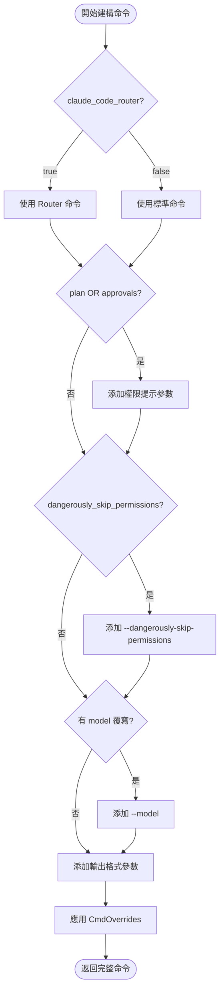

# 輸入參數詳解

> **文件編號**: DOC-001
> **對應任務**: [E.01] 撰寫 09-input-parameters.md - 輸入參數詳解
> **原始碼位置**: `crates/executors/src/executors/claude.rs:52-76`

## 概述

Claude Code Executor 透過 `ClaudeCode` 結構接收多種輸入參數，這些參數控制了 Claude Code CLI 的行為和配置。

## ClaudeCode 結構

**檔案位置**: `claude.rs:52-76`

```rust
#[derive(Debug, Clone, Default, Serialize, Deserialize)]
pub struct ClaudeCode {
    /// 附加提示內容
    pub append_prompt: AppendPrompt,

    /// 是否使用 Router 模式
    pub claude_code_router: Option<bool>,

    /// 計畫模式
    pub plan: Option<bool>,

    /// 審批服務
    pub approvals: Option<bool>,

    /// 模型覆寫
    pub model: Option<String>,

    /// 跳過權限檢查 (危險)
    pub dangerously_skip_permissions: Option<bool>,

    /// 停用 API Key
    pub disable_api_key: Option<bool>,

    /// 命令覆寫
    pub cmd: CmdOverrides,

    /// 審批服務實例 (內部使用)
    #[serde(skip)]
    approvals_service: Option<Arc<dyn ExecutorApprovalService>>,
}
```

## 參數詳解

### append_prompt

```rust
pub struct AppendPrompt {
    /// 附加到提示前面的內容
    pub prepend: Option<String>,

    /// 附加到提示後面的內容
    pub append: Option<String>,
}
```

**用途**: 在使用者提示前後添加系統級指令。

**範例**:
```rust
let append_prompt = AppendPrompt {
    prepend: Some("你是一個專業的 Rust 開發者。".to_string()),
    append: Some("請使用繁體中文回答。".to_string()),
};
```

### claude_code_router

| 值 | 說明 | 命令 |
|----|------|------|
| `None` / `Some(false)` | 標準模式 | `npx -y @anthropic-ai/claude-code@2.1.7` |
| `Some(true)` | Router 模式 | `npx -y @musistudio/claude-code-router@1.0.66 code` |

**用途**: 切換到支援多模型路由的版本。

### plan

| 值 | 說明 |
|----|------|
| `None` / `Some(false)` | 直接執行模式 |
| `Some(true)` | 計畫模式 (需使用者確認後才執行) |

**效果**: 啟用時會添加 `--permission-prompt-tool=stdio` 和 `--permission-mode=bypass_permissions`。

### approvals

| 值 | 說明 |
|----|------|
| `None` / `Some(false)` | 自動審批所有工具 |
| `Some(true)` | 需要人工審批工具使用 |

**效果**: 與 `plan` 相同，啟用權限提示工具。

### model

**類型**: `Option<String>`

**用途**: 覆寫預設模型。

**範例值**:
- `claude-sonnet-4-20250514`
- `claude-opus-4-20250514`
- `claude-3-5-sonnet-20240620`

**效果**: 添加 `--model <model>` 參數。

### dangerously_skip_permissions

| 值 | 說明 |
|----|------|
| `None` / `Some(false)` | 正常權限檢查 |
| `Some(true)` | 跳過所有權限檢查 ⚠️ |

**效果**: 添加 `--dangerously-skip-permissions` 參數。

**警告**: 此選項會跳過所有安全檢查，僅用於受信任的環境。

### disable_api_key

| 值 | 說明 |
|----|------|
| `None` / `Some(false)` | 使用環境變數中的 API Key |
| `Some(true)` | 移除 `ANTHROPIC_API_KEY` 環境變數 |

**用途**: 測試或使用其他認證方式時使用。

### cmd (CmdOverrides)

```rust
pub struct CmdOverrides {
    /// 覆寫基礎命令
    pub base_command_override: Option<String>,

    /// 額外命令列參數
    pub additional_params: Option<Vec<String>>,

    /// 額外環境變數
    pub env_vars: Option<HashMap<String, String>>,
}
```

**範例**:
```rust
let cmd = CmdOverrides {
    base_command_override: Some("./custom-claude".to_string()),
    additional_params: Some(vec!["--custom-flag".to_string()]),
    env_vars: Some(HashMap::from([
        ("CUSTOM_VAR".to_string(), "value".to_string()),
    ])),
};
```

## 參數組合效果表

| plan | approvals | skip_permissions | 效果 |
|------|-----------|------------------|------|
| false | false | false | 標準自動執行 |
| true | false | false | 計畫模式 + 自動審批 |
| false | true | false | 自動執行 + 人工審批 |
| true | true | false | 計畫模式 + 人工審批 |
| - | - | true | 跳過所有權限 ⚠️ |

## 參數處理流程



## ExecutorProfileId

**用途**: 標識執行器配置。

```rust
pub struct ExecutorProfileId {
    /// 基礎執行器類型
    pub executor: BaseCodingAgent,

    /// 可選的變體標籤
    pub variant: Option<String>,
}
```

### BaseCodingAgent 類型

```rust
pub enum BaseCodingAgent {
    ClaudeCode,
    Codex,
    Gemini,
    Qwen,
    OpenCode,
    ACP,
}
```

## ExecutionEnv

**用途**: 執行環境配置。

```rust
pub struct ExecutionEnv {
    /// 環境變數
    pub env_vars: HashMap<String, String>,

    /// 工作目錄
    pub working_dir: PathBuf,

    /// 其他配置...
}
```

## 參數驗證

在 `build_command_builder()` 中，參數會被驗證：

```rust
async fn build_command_builder(&self) -> Result<CommandBuilder, CommandBuildError> {
    // 驗證參數組合
    if self.plan.unwrap_or(false) && self.dangerously_skip_permissions.unwrap_or(false) {
        // 這種組合可能無意義，但不會報錯
    }

    // 建構命令...
}
```

## 運行時注入

某些參數在運行時注入：

```rust
impl ClaudeCode {
    /// 注入審批服務
    pub fn use_approvals(&mut self, service: Arc<dyn ExecutorApprovalService>) {
        self.approvals_service = Some(service);
    }
}
```

---

*上一章節: [08-next-action-chain.md](./08-next-action-chain.md) - NextAction 鏈式執行機制*
*下一章節: [10-session-management.md](./10-session-management.md) - Session 管理與 Follow-up*
