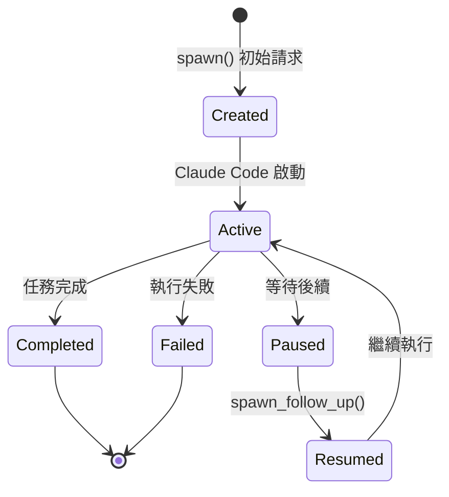
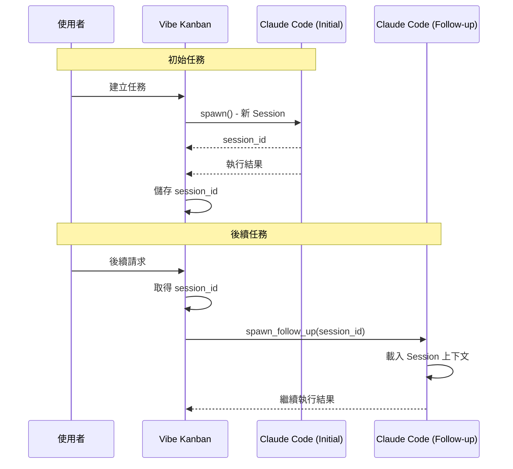
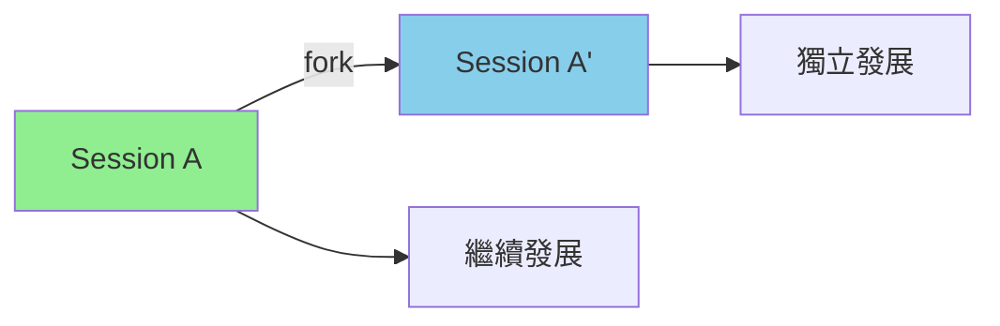
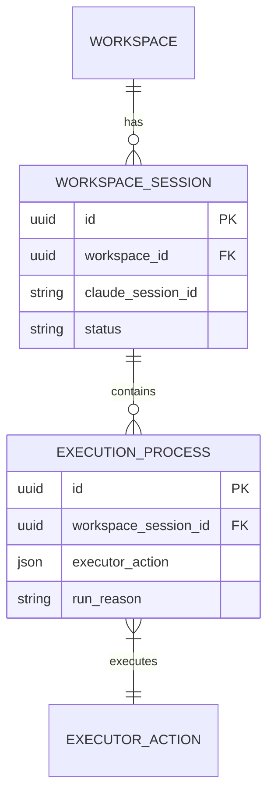
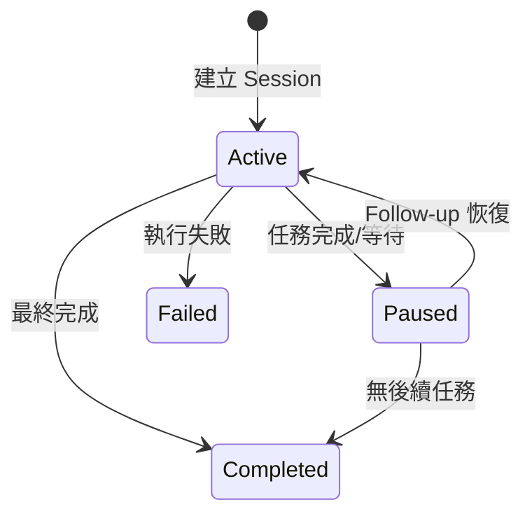

# Session 管理與 Follow-up

> **文件編號**: DOC-001
> **對應任務**: [E.02] 撰寫 10-session-management.md - Session 管理與 Follow-up
> **原始碼位置**:
> - `crates/executors/src/executors/claude.rs:139-172`
> - `crates/executors/src/actions/coding_agent_follow_up.rs`

## 概述

Session 管理機制允許 Claude Code 在多個對話回合中保持上下文。透過 Session ID，可以恢復先前的對話並繼續執行任務。

## Session 生命週期



## StandardCodingAgentExecutor Trait

**檔案位置**: `claude.rs:139-172`

```rust
#[async_trait]
impl StandardCodingAgentExecutor for ClaudeCode {
    /// 初始任務 - 建立新 Session
    async fn spawn(
        &self,
        current_dir: &Path,
        prompt: &str,
        env: &ExecutionEnv,
    ) -> Result<SpawnedChild, ExecutorError> {
        let command_builder = self.build_command_builder().await?;
        let command_parts = command_builder.build_initial()?;
        self.spawn_internal(current_dir, command_parts, prompt, env, None)
            .await
    }

    /// 後續任務 - 恢復現有 Session
    async fn spawn_follow_up(
        &self,
        current_dir: &Path,
        prompt: &str,
        session_id: &str,
        env: &ExecutionEnv,
    ) -> Result<SpawnedChild, ExecutorError> {
        let command_builder = self.build_command_builder().await?;
        let command_parts = command_builder.build_follow_up(&[
            "--fork-session".to_string(),
            "--resume".to_string(),
            session_id.to_string(),
        ])?;
        self.spawn_internal(current_dir, command_parts, prompt, env, None)
            .await
    }
}
```

## Initial vs Follow-up 命令差異

### Initial 命令

```bash
npx -y @anthropic-ai/claude-code@2.1.7 \
  -p \
  --verbose \
  --output-format=stream-json \
  --input-format=stream-json \
  --include-partial-messages \
  --disallowedTools=AskUserQuestion
```

### Follow-up 命令

```bash
npx -y @anthropic-ai/claude-code@2.1.7 \
  -p \
  --verbose \
  --output-format=stream-json \
  --input-format=stream-json \
  --include-partial-messages \
  --disallowedTools=AskUserQuestion \
  --fork-session \                    # 分叉 Session
  --resume <session_id>               # 恢復指定 Session
```

## Session ID 取得與使用

### Session ID 來源

Session ID 由 Claude Code 在初始執行時產生，並透過 JSON 輸出回傳：

```json
{
  "type": "session",
  "session_id": "abc123-session-id-xyz789"
}
```

### CodingAgentFollowUpRequest

```rust
pub struct CodingAgentFollowUpRequest {
    pub prompt: String,
    pub session_id: String,  // 必須提供
    pub executor_profile_id: ExecutorProfileId,
    pub working_dir: Option<String>,
}
```

## Session 恢復流程



## Fork Session 機制

`--fork-session` 參數的作用：

1. **複製 Session 狀態**: 建立 Session 的分支副本
2. **保留對話歷史**: 新 Session 包含原 Session 的所有對話
3. **獨立執行**: 分叉後的變更不影響原 Session



## WorkspaceSession 關係

```rust
pub struct WorkspaceSession {
    pub id: Uuid,
    pub workspace_id: Uuid,
    pub claude_session_id: Option<String>,  // Claude Code Session ID
    pub status: SessionStatus,
    pub created_at: DateTime<Utc>,
}
```

### 關聯圖



## Session 狀態管理

### SessionStatus

```rust
pub enum SessionStatus {
    Active,      // 正在執行
    Paused,      // 暫停中
    Completed,   // 已完成
    Failed,      // 已失敗
}
```

### 狀態轉換



## 錯誤處理

### Session 不存在

```rust
// 當 session_id 無效時
Err(ExecutorError::SessionNotFound(session_id.to_string()))
```

### Session 已完成

```rust
// 嘗試恢復已結束的 Session
Err(ExecutorError::SessionAlreadyCompleted(session_id.to_string()))
```

## 最佳實踐

### 1. 保存 Session ID

```rust
// 從初始執行結果中提取 session_id
if let Ok(session_msg) = serde_json::from_str::<SessionMessage>(&output) {
    save_session_id(session_msg.session_id);
}
```

### 2. 正確使用 Follow-up

```rust
// 確保 session_id 有效
let follow_up = CodingAgentFollowUpRequest {
    prompt: "繼續上次的任務...".to_string(),
    session_id: stored_session_id.clone(),
    executor_profile_id: original_profile.clone(),
    working_dir: None,
};
```

### 3. 處理 Session 過期

Claude Code Session 可能會過期，應處理此情況：

```rust
match spawn_follow_up(session_id).await {
    Err(ExecutorError::SessionExpired(_)) => {
        // 建立新 Session
        spawn_initial().await
    }
    result => result,
}
```

---

*上一章節: [09-input-parameters.md](./09-input-parameters.md) - 輸入參數詳解*
*下一章節: [README.md](./README.md) - 文件索引與導覽*
