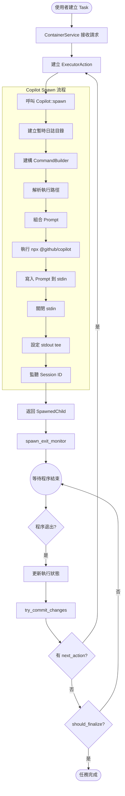
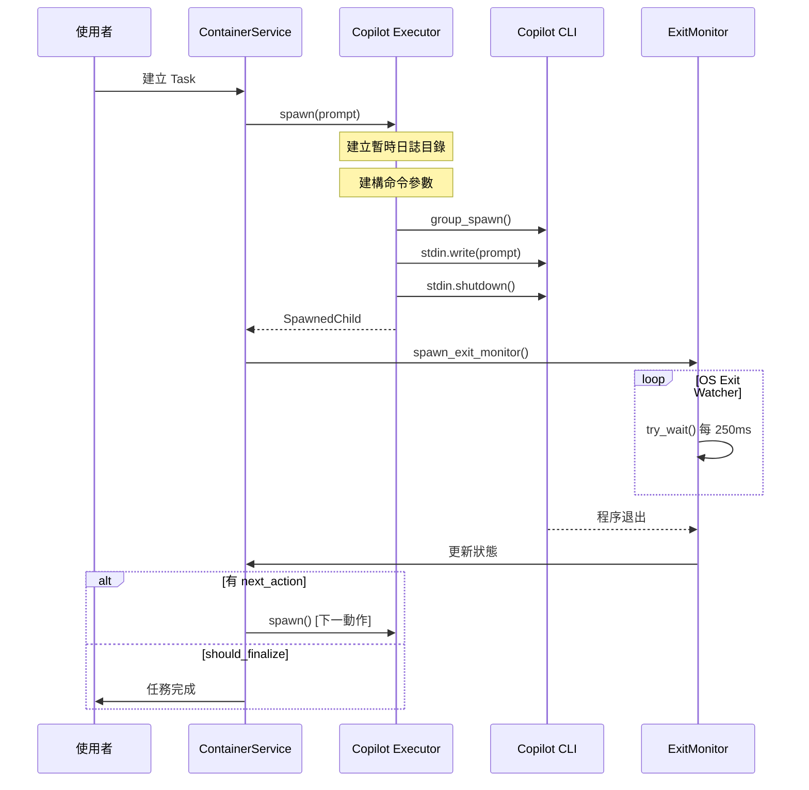

# Copilot 執行流程概述

> **文件編號**: DOC-002
> **對應任務**: [B.01] 撰寫 01-overview.md - Copilot 執行流程概述
> **原始碼位置**: `crates/executors/src/executors/copilot.rs`

## 概述

GitHub Copilot 是 Vibe Kanban 支援的 Coding Agent 之一。本文件詳細說明 Copilot 在系統中的執行流程，包含 spawn 機制、參數處理、以及與其他 Executor 的差異。

## Copilot 結構定義

```rust
#[derive(Debug, Clone, Serialize, Deserialize, PartialEq, TS, JsonSchema)]
pub struct Copilot {
    pub append_prompt: AppendPrompt,        // 附加提示詞
    pub model: Option<String>,              // 模型選擇
    pub allow_all_tools: Option<bool>,      // 允許所有工具
    pub allow_tool: Option<String>,         // 允許特定工具
    pub deny_tool: Option<String>,          // 禁用特定工具
    pub add_dir: Option<Vec<String>>,       // 額外目錄
    pub disable_mcp_server: Option<Vec<String>>, // 禁用 MCP 伺服器
    pub cmd: CmdOverrides,                  // 命令覆蓋
}
```

## 執行流程總覽



## 關鍵組件

### 1. StandardCodingAgentExecutor Trait

Copilot 實作 `StandardCodingAgentExecutor` trait，提供統一的執行器介面：

```rust
#[async_trait]
impl StandardCodingAgentExecutor for Copilot {
    async fn spawn(&self, current_dir: &Path, prompt: &str, env: &ExecutionEnv)
        -> Result<SpawnedChild, ExecutorError>;

    async fn spawn_follow_up(&self, current_dir: &Path, prompt: &str, session_id: &str, env: &ExecutionEnv)
        -> Result<SpawnedChild, ExecutorError>;

    fn normalize_logs(&self, msg_store: Arc<MsgStore>, worktree_path: &Path);

    fn default_mcp_config_path(&self) -> Option<PathBuf>;

    fn get_availability_info(&self) -> AvailabilityInfo;
}
```

### 2. CommandBuilder

負責建構 Copilot CLI 命令：

```rust
fn build_command_builder(&self, log_dir: &str) -> Result<CommandBuilder, CommandBuildError> {
    let mut builder = CommandBuilder::new("npx -y @github/copilot@0.0.375")
        .params(["--no-color", "--log-level", "debug", "--log-dir", log_dir]);

    // 可選參數處理
    if self.allow_all_tools.unwrap_or(false) {
        builder = builder.extend_params(["--allow-all-tools"]);
    }
    // ... 更多參數處理
}
```

### 3. SpawnedChild

spawn 返回的結構：

```rust
pub struct SpawnedChild {
    pub child: AsyncGroupChild,
    pub exit_signal: Option<ExecutorExitSignal>,   // Copilot: None
    pub interrupt_sender: Option<InterruptSender>, // Copilot: None
}
```

## 執行版本

Copilot 使用固定版本執行：

```
npx -y @github/copilot@0.0.375
```

## Capabilities 比較

```mermaid
graph LR
    subgraph "Copilot"
        C1[capabilities: vec!&#40;&#41;]
    end

    subgraph "Claude Code"
        CC1[capabilities: SessionFork]
    end

    subgraph "Codex"
        CDX1[capabilities: SessionFork + SetupHelper]
    end
```



Copilot 目前沒有任何特殊 capabilities，這是導致無法自動循環的關鍵因素之一。

## 時序圖



## MCP 配置

Copilot 的 MCP 配置路徑：

```rust
fn default_mcp_config_path(&self) -> Option<PathBuf> {
    dirs::home_dir().map(|home| home.join(".copilot").join("mcp-config.json"))
}
```

## 可用性檢查

系統透過以下方式判斷 Copilot 是否可用：

```rust
fn get_availability_info(&self) -> AvailabilityInfo {
    let mcp_config_found = self.default_mcp_config_path()
        .map(|p| p.exists())
        .unwrap_or(false);

    let installation_indicator_found = dirs::home_dir()
        .map(|home| home.join(".copilot").join("config.json").exists())
        .unwrap_or(false);

    if mcp_config_found || installation_indicator_found {
        AvailabilityInfo::InstallationFound
    } else {
        AvailabilityInfo::NotFound
    }
}
```

---

*下一章節: [02-spawn-mechanism.md](./02-spawn-mechanism.md) - Copilot Spawn 機制*
