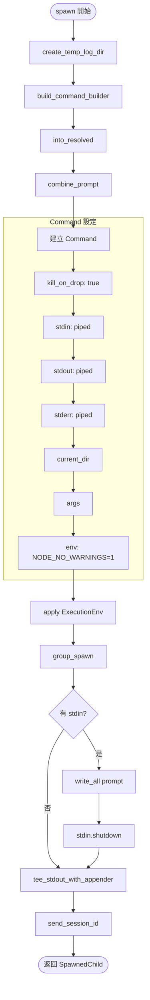
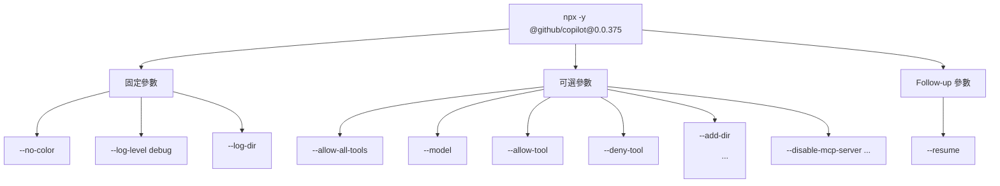
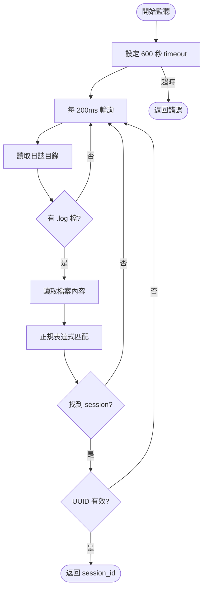
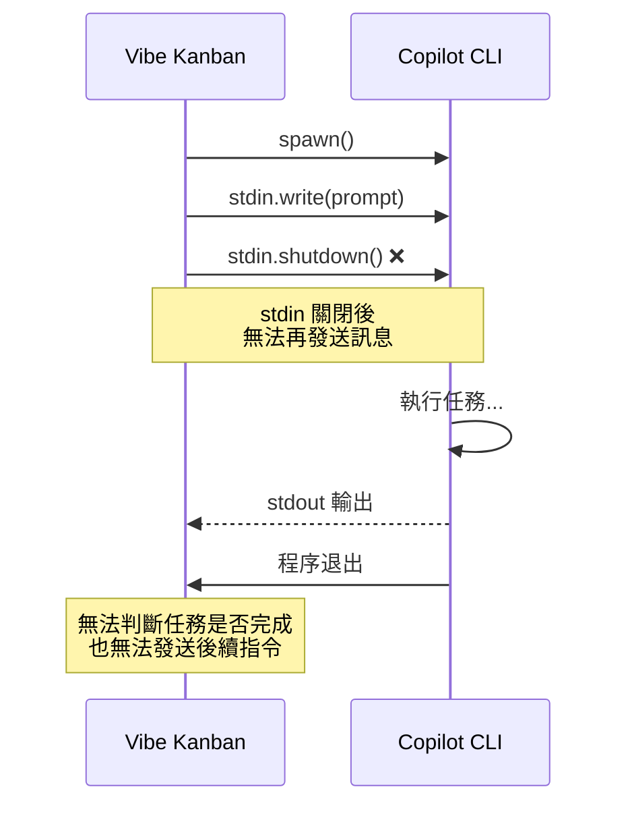

# Copilot Spawn 機制

> **文件編號**: DOC-002
> **對應任務**: [B.02] 撰寫 02-spawn-mechanism.md - Copilot Spawn 機制
> **原始碼位置**: `crates/executors/src/executors/copilot.rs:101-185`

## 概述

本章節詳細說明 Copilot 的 spawn 機制，包含初始 spawn 和 follow-up spawn 兩種模式。

## spawn() 方法

### 原始碼分析

**檔案位置**: `copilot.rs:101-141`

```rust
async fn spawn(
    &self,
    current_dir: &Path,
    prompt: &str,
    env: &ExecutionEnv,
) -> Result<SpawnedChild, ExecutorError> {
    // Step 1: 建立暫時日誌目錄
    let log_dir = Self::create_temp_log_dir(current_dir).await?;

    // Step 2: 建構命令
    let command_parts = self
        .build_command_builder(&log_dir.to_string_lossy())?
        .build_initial()?;
    let (program_path, args) = command_parts.into_resolved().await?;

    // Step 3: 組合 Prompt
    let combined_prompt = self.append_prompt.combine_prompt(prompt);

    // Step 4: 設定 Command
    let mut command = Command::new(program_path);
    command
        .kill_on_drop(true)
        .stdin(Stdio::piped())
        .stdout(Stdio::piped())
        .stderr(Stdio::piped())
        .current_dir(current_dir)
        .args(&args)
        .env("NODE_NO_WARNINGS", "1");

    env.clone()
        .with_profile(&self.cmd)
        .apply_to_command(&mut command);

    // Step 5: 執行程序
    let mut child = command.group_spawn()?;

    // Step 6: 寫入 Prompt 到 stdin
    if let Some(mut stdin) = child.inner().stdin.take() {
        stdin.write_all(combined_prompt.as_bytes()).await?;
        stdin.shutdown().await?;
    }

    // Step 7: 設定 stdout tee 和 session ID 監聽
    let (_, appender) = stdout_dup::tee_stdout_with_appender(&mut child)?;
    Self::send_session_id(log_dir, appender);

    Ok(child.into())
}
```

### 流程圖



## spawn_follow_up() 方法

### 原始碼分析

**檔案位置**: `copilot.rs:143-185`

```rust
async fn spawn_follow_up(
    &self,
    current_dir: &Path,
    prompt: &str,
    session_id: &str,
    env: &ExecutionEnv,
) -> Result<SpawnedChild, ExecutorError> {
    let log_dir = Self::create_temp_log_dir(current_dir).await?;

    // 關鍵差異: 使用 --resume 參數
    let command_parts = self
        .build_command_builder(&log_dir.to_string_lossy())?
        .build_follow_up(&["--resume".to_string(), session_id.to_string()])?;

    // ... 後續與 spawn() 相同
}
```

### spawn vs spawn_follow_up 比較

| 特性 | spawn() | spawn_follow_up() |
|------|---------|-------------------|
| 用途 | 初始執行 | 恢復 session |
| 額外參數 | 無 | `--resume <session_id>` |
| CommandBuilder | `build_initial()` | `build_follow_up()` |
| session_id | 從日誌提取 | 由參數傳入 |

## 命令參數建構

### build_command_builder()

**檔案位置**: `copilot.rs:58-96`

```rust
fn build_command_builder(&self, log_dir: &str) -> Result<CommandBuilder, CommandBuildError> {
    let mut builder = CommandBuilder::new("npx -y @github/copilot@0.0.375")
        .params(["--no-color", "--log-level", "debug", "--log-dir", log_dir]);

    // 可選參數
    if self.allow_all_tools.unwrap_or(false) {
        builder = builder.extend_params(["--allow-all-tools"]);
    }
    if let Some(model) = &self.model {
        builder = builder.extend_params(["--model", model]);
    }
    if let Some(tool) = &self.allow_tool {
        builder = builder.extend_params(["--allow-tool", tool]);
    }
    if let Some(tool) = &self.deny_tool {
        builder = builder.extend_params(["--deny-tool", tool]);
    }
    if let Some(dirs) = &self.add_dir {
        for dir in dirs {
            builder = builder.extend_params(["--add-dir", dir]);
        }
    }
    if let Some(servers) = &self.disable_mcp_server {
        for server in servers {
            builder = builder.extend_params(["--disable-mcp-server", server]);
        }
    }

    apply_overrides(builder, &self.cmd)
}
```

### 參數樹狀圖



## 日誌目錄管理

### create_temp_log_dir()

**檔案位置**: `copilot.rs:256-270`

```rust
async fn create_temp_log_dir(current_dir: &Path) -> Result<PathBuf, ExecutorError> {
    // 基礎日誌目錄
    let base_log_dir = get_vibe_kanban_temp_dir().join("copilot_logs");
    fs::create_dir_all(&base_log_dir).await.map_err(ExecutorError::Io)?;

    // 執行專用日誌目錄 (包含 UUID)
    let run_log_dir = base_log_dir
        .join(current_dir.file_name().unwrap_or_default())
        .join(Uuid::new_v4().to_string());
    fs::create_dir_all(&run_log_dir).await.map_err(ExecutorError::Io)?;

    Ok(run_log_dir)
}
```

### 目錄結構

```
<temp_dir>/copilot_logs/
└── <worktree_name>/
    └── <uuid>/
        ├── copilot.log
        └── session-<uuid>.log
```

## Session ID 提取機制

### watch_session_id()

**檔案位置**: `copilot.rs:273-301`

```rust
async fn watch_session_id(log_dir_path: PathBuf) -> Result<String, String> {
    let session_regex = Regex::new(r"events to session ([0-9a-fA-F-]{36})")
        .map_err(|e| e.to_string())?;

    timeout(Duration::from_secs(600), async move {
        let mut ticker = interval(Duration::from_millis(200));
        loop {
            if let Ok(mut rd) = fs::read_dir(&log_dir_clone).await {
                while let Ok(Some(entry)) = rd.next_entry().await {
                    let path = entry.path();
                    if path.extension().map(|e| e == "log").unwrap_or(false)
                        && let Ok(content) = fs::read_to_string(&path).await
                        && let Some(caps) = session_regex.captures(&content)
                        && let Some(matched) = caps.get(1)
                    {
                        let uuid_str = matched.as_str();
                        if Uuid::parse_str(uuid_str).is_ok() {
                            return Ok(uuid_str.to_string());
                        }
                    }
                }
            }
            ticker.tick().await;
        }
    }).await
    .map_err(|_| format!("No session ID found in log files at {log_dir_path:?}"))?
}
```

### Session ID 提取流程



### send_session_id()

**檔案位置**: `copilot.rs:306-318`

```rust
const SESSION_PREFIX: &'static str = "[copilot-session] ";

fn send_session_id(log_dir_path: PathBuf, stdout_appender: StdoutAppender) {
    tokio::spawn(async move {
        match Self::watch_session_id(log_dir_path).await {
            Ok(session_id) => {
                let session_line = format!("{}{}\n", Self::SESSION_PREFIX, session_id);
                stdout_appender.append_line(&session_line);
            }
            Err(e) => {
                tracing::error!("Failed to find session ID: {}", e);
            }
        }
    });
}
```

## 關鍵問題分析

### stdin 關閉後無法繼續通訊



這是 Copilot 無法自動循環的根本原因 - **stdin 在寫入 prompt 後立即關閉，無法進行雙向通訊**。

---

*上一章節: [01-overview.md](./01-overview.md) - Copilot 執行流程概述*
*下一章節: [03-exit-monitoring.md](./03-exit-monitoring.md) - 退出監控機制*
