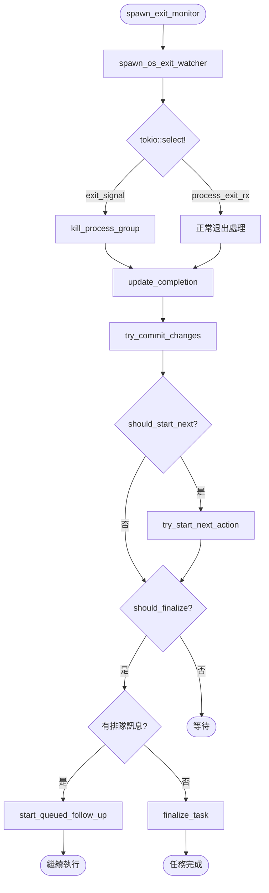
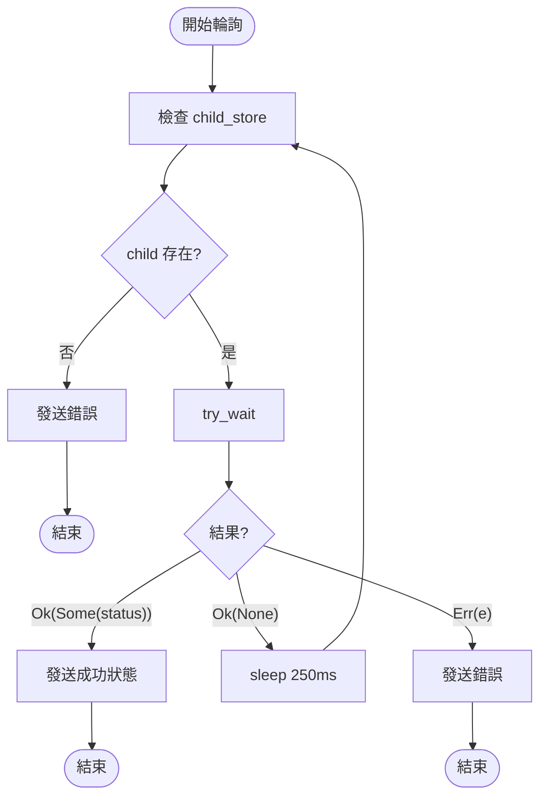
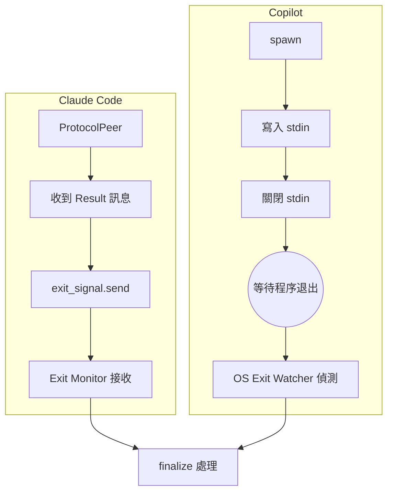
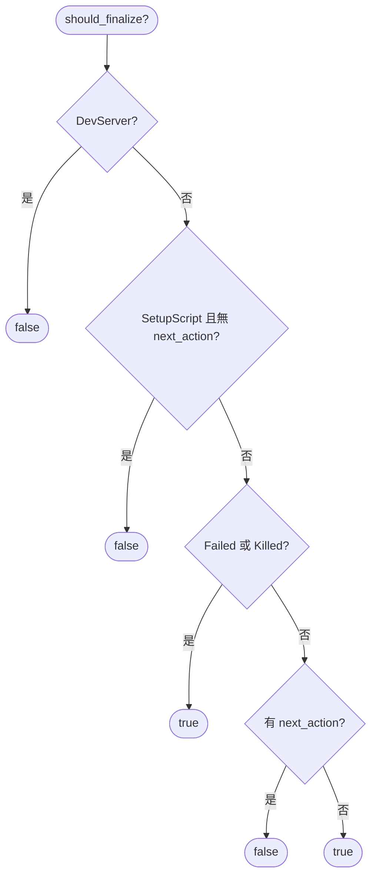
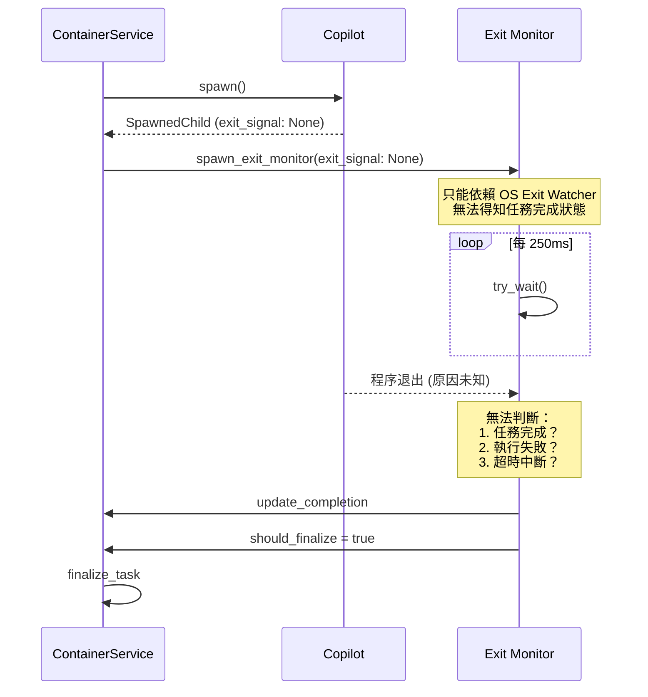

# 退出監控機制

> **文件編號**: DOC-002
> **對應任務**: [B.03] 撰寫 03-exit-monitoring.md - 退出監控機制
> **原始碼位置**: `crates/local-deployment/src/container.rs:344-563`

## 概述

當 Copilot (或任何 CodingAgent) spawn 後，系統透過 Exit Monitor 機制持續監控程序狀態，並在程序退出時執行後續動作。

## spawn_exit_monitor()

這是監控程序退出的核心方法。

### 程式碼結構

**檔案位置**: `local-deployment/container.rs`

```rust
pub fn spawn_exit_monitor(
    &self,
    exec_id: &Uuid,
    exit_signal: Option<ExecutorExitSignal>,
) -> JoinHandle<()> {
    // 1. 啟動 OS Exit Watcher
    let mut process_exit_rx = self.spawn_os_exit_watcher(exec_id);

    tokio::spawn(async move {
        // 2. 等待程序退出 (任一訊號)
        tokio::select! {
            // 分支 A: Executor 主動發送退出訊號
            exit_result = &mut exit_signal_future => {
                // 執行器主動結束
                command::kill_process_group(&mut child).await;
            }
            // 分支 B: OS 程序自然退出
            exit_status_result = &mut process_exit_rx => {
                // OS 程序退出
            }
        }

        // 3. 更新執行狀態
        ExecutionProcess::update_completion(...).await;

        // 4. 嘗試提交變更
        let changes_committed = container.try_commit_changes(&ctx).await;

        // 5. 嘗試啟動下一個動作
        if should_start_next {
            container.try_start_next_action(&ctx).await;
        }

        // 6. 判斷是否應該結束
        if container.should_finalize(&ctx) {
            // 處理排隊的訊息
            if let Some(queued_msg) = queued_message_service.take_queued(...) {
                container.start_queued_follow_up(&ctx, &queued_msg).await;
            } else {
                container.finalize_task(...).await;
            }
        }
    })
}
```

### 流程圖



## spawn_os_exit_watcher()

這是輪詢程序狀態的底層方法。

### 程式碼結構

```rust
pub fn spawn_os_exit_watcher(&self, exec_id: Uuid) -> Receiver<Result<ExitStatus, Error>> {
    let (tx, rx) = tokio::sync::oneshot::channel();

    tokio::spawn(async move {
        loop {
            if let Some(child_lock) = child_store.get(&exec_id) {
                match child_handler.try_wait() {
                    Ok(Some(status)) => {
                        // 程序已退出
                        tx.send(Ok(status));
                        break;
                    }
                    Ok(None) => {
                        // 還在運行，繼續輪詢
                    }
                    Err(e) => {
                        tx.send(Err(e));
                        break;
                    }
                }
            } else {
                tx.send(Err(...));
                break;
            }

            // 每 250ms 輪詢一次
            tokio::time::sleep(Duration::from_millis(250)).await;
        }
    });

    rx
}
```

### 輪詢流程



## ExecutorExitSignal vs OS Exit

系統支援兩種退出偵測機制：

### 1. ExecutorExitSignal (Executor 主動)

```rust
pub type ExecutorExitSignal = tokio::sync::oneshot::Receiver<ExecutorExitResult>;

pub enum ExecutorExitResult {
    Success,  // 成功完成
    Failure,  // 執行失敗
}
```

**支援的 Executor**:
- Claude Code (透過 ProtocolPeer)
- Gemini
- 其他有協議層的 Executor

**Copilot 狀態**: ❌ **不支援** - `SpawnedChild.exit_signal = None`

### 2. OS Exit (程序自然退出)

透過 `spawn_os_exit_watcher()` 每 250ms 輪詢 `try_wait()` 檢查程序狀態。

**所有 Executor 都支援此機制**，包含 Copilot。

### 比較圖



## should_finalize() 判斷

**檔案位置**: `services/container.rs:133-164`

決定任務是否應該結束：

```rust
fn should_finalize(&self, ctx: &ExecutionContext) -> bool {
    // 規則 1: DevServer 永不結束
    if ctx.execution_process.run_reason == DevServer {
        return false;
    }

    // 規則 2: 平行模式的 SetupScript 不結束
    if ctx.execution_process.run_reason == SetupScript
        && action.next_action.is_none() {
        return false;
    }

    // 規則 3: 失敗或被殺 - 總是結束
    if ctx.execution_process.status == Failed || Killed {
        return true;
    }

    // 規則 4: 沒有下一個動作 - 結束
    action.next_action.is_none()
}
```

### 判斷邏輯流程



## try_start_next_action()

**檔案位置**: `services/container.rs:1165-1198`

當前動作完成後，嘗試啟動下一個動作：

```rust
async fn try_start_next_action(&self, ctx: &ExecutionContext) -> Result<(), ContainerError> {
    let action = ctx.execution_process.executor_action()?;

    // 檢查是否有下一個動作
    let next_action = if let Some(next_action) = action.next_action() {
        next_action
    } else {
        return Ok(());  // 沒有下一個動作
    };

    // 決定下一個動作的執行原因
    let next_run_reason = match (action.typ(), next_action.typ()) {
        (ScriptRequest(_), ScriptRequest(_)) => SetupScript,
        (CodingAgent..., ScriptRequest(_)) => CleanupScript,
        (_, CodingAgent...) => CodingAgent,
    };

    // 遞迴呼叫 start_execution
    self.start_execution(&ctx.workspace, &ctx.session, next_action, &next_run_reason)
        .await?;

    Ok(())
}
```

### Next Action 轉換規則

| 當前動作 | 下一動作 | 執行原因 |
|----------|----------|----------|
| ScriptRequest | ScriptRequest | SetupScript |
| CodingAgentInitialRequest | ScriptRequest | CleanupScript |
| CodingAgentFollowUpRequest | ScriptRequest | CleanupScript |
| ReviewRequest | ScriptRequest | CleanupScript |
| 任何類型 | CodingAgentInitialRequest | CodingAgent |
| 任何類型 | CodingAgentFollowUpRequest | CodingAgent |
| 任何類型 | ReviewRequest | CodingAgent |

## Copilot 的監控問題

### 問題分析



### 關鍵問題

1. **無 exit_signal**: Copilot 無法主動通知任務完成
2. **無 interrupt_sender**: 無法優雅中斷 Copilot
3. **無 ProtocolPeer**: 無法進行雙向通訊
4. **無 capabilities**: 無法利用 SessionFork 等功能

---

*上一章節: [02-spawn-mechanism.md](./02-spawn-mechanism.md) - Copilot Spawn 機制*
*下一章節: [04-comparison-with-claude.md](./04-comparison-with-claude.md) - 與 Claude Code 差異比較*
