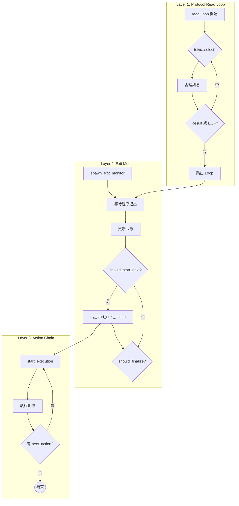
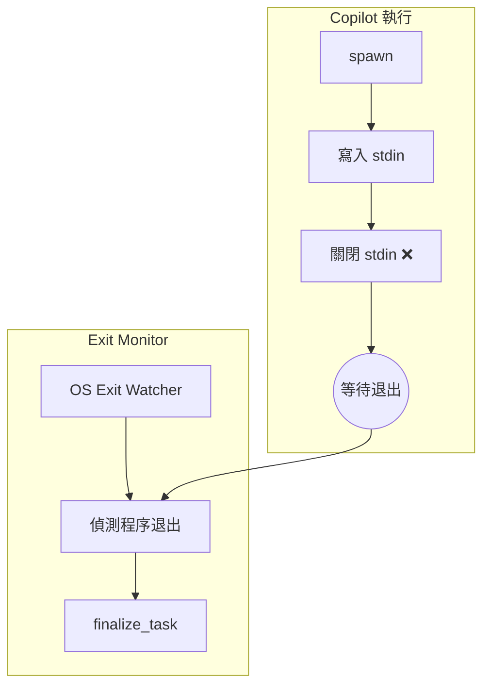
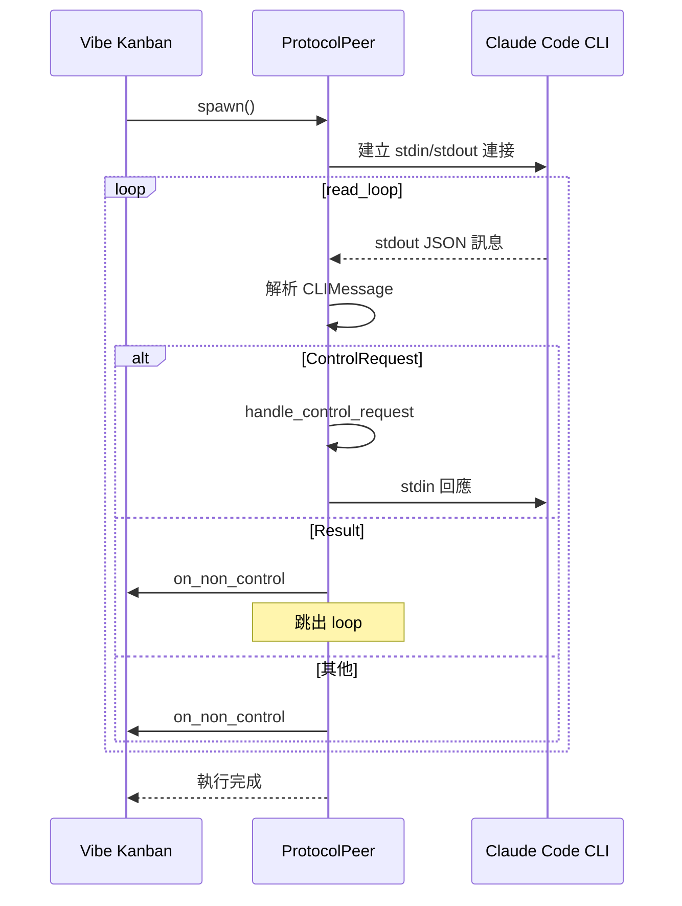
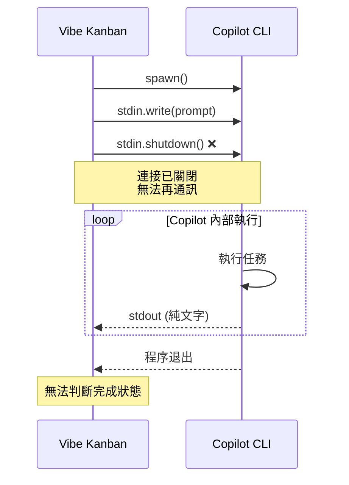

# 與 Claude Code 差異比較

> **文件編號**: DOC-002
> **對應任務**: [C.01] 撰寫 04-comparison-with-claude.md - 與 Claude Code 差異比較
> **原始碼位置**: 多個檔案

## 概述

本章節詳細比較 Copilot 與 Claude Code 在 Vibe Kanban 中的執行機制差異，分析 Copilot 無法自動循環執行的根本原因。

## 架構比較

### Claude Code 三層 Loop 機制



### Copilot 單層機制



## 功能特性比較表

| 特性 | Claude Code | Copilot | 影響 |
|------|-------------|---------|------|
| **ProtocolPeer** | ✅ 有 | ❌ 無 | 無法雙向通訊 |
| **read_loop** | ✅ 持續讀取 | ❌ 無 | 無法即時處理回應 |
| **exit_signal** | ✅ 有 | ❌ None | 無法主動通知完成 |
| **interrupt_sender** | ✅ 有 | ❌ None | 無法優雅中斷 |
| **SessionFork** | ✅ 有 | ❌ 無 | 無法分支 session |
| **SetupHelper** | ❌ 無 | ❌ 無 | - |
| **stdin 生命週期** | 持續開啟 | 寫入後關閉 | 無法發送後續指令 |
| **stdout 處理** | JSON 協議解析 | 純文字處理 | 無法解析結構化回應 |

## SpawnedChild 比較

### Claude Code

```rust
// claude.rs 返回
SpawnedChild {
    child: AsyncGroupChild,
    exit_signal: None,
    interrupt_sender: Some(interrupt_tx),  // ✅ 有
}
```

### Copilot

```rust
// copilot.rs 返回
SpawnedChild {
    child: AsyncGroupChild,
    exit_signal: None,                      // ❌ 無
    interrupt_sender: None,                 // ❌ 無
}
```

## Capabilities 比較

**檔案位置**: `executors/mod.rs:162-179`

```rust
pub fn capabilities(&self) -> Vec<BaseAgentCapability> {
    match self {
        // Claude Code - 有 SessionFork
        Self::ClaudeCode(_) | Self::Amp(_) | Self::Gemini(_)
        | Self::QwenCode(_) | Self::Droid(_) | Self::Opencode(_)
            => vec![BaseAgentCapability::SessionFork],

        // Codex - 有 SessionFork + SetupHelper
        Self::Codex(_) => vec![
            BaseAgentCapability::SessionFork,
            BaseAgentCapability::SetupHelper,
        ],

        // CursorAgent - 只有 SetupHelper
        Self::CursorAgent(_) => vec![BaseAgentCapability::SetupHelper],

        // Copilot - 沒有任何 capability ❌
        Self::Copilot(_) => vec![],
    }
}
```

### Capabilities 視覺化

```mermaid
graph LR
    subgraph "Full Capabilities"
        CODEX[Codex<br/>SessionFork + SetupHelper]
    end

    subgraph "Session Support"
        CC[Claude Code<br/>SessionFork]
        AMP[Amp<br/>SessionFork]
        GEM[Gemini<br/>SessionFork]
        QWEN[QwenCode<br/>SessionFork]
        DROID[Droid<br/>SessionFork]
        OPEN[Opencode<br/>SessionFork]
    end

    subgraph "Setup Only"
        CURSOR[CursorAgent<br/>SetupHelper]
    end

    subgraph "No Capabilities"
        COPILOT[Copilot<br/>vec!&#40;&#41; ❌]
    end

    style COPILOT fill:#ffcccc
```



## 通訊機制比較

### Claude Code: ProtocolPeer 雙向通訊



### Copilot: 單向寫入



## Log Normalization 比較

### Claude Code

```rust
// claude.rs - 使用 JSON 協議
fn normalize_logs(&self, msg_store: Arc<MsgStore>, worktree_path: &Path) {
    // 透過 ProtocolPeer 處理 JSON 格式訊息
    // 支援 ControlRequest, Result 等結構化訊息
}
```

### Copilot

```rust
// copilot.rs - 純文字處理
fn normalize_logs(&self, msg_store: Arc<MsgStore>, _worktree_path: &Path) {
    // 使用 PlainTextLogProcessor
    let mut processor = Self::create_simple_stdout_normalizer(entry_index_counter);

    while let Some(Ok(line)) = stdout_lines.next().await {
        // 處理 session ID 前綴
        if let Some(session_id) = line.strip_prefix(Self::SESSION_PREFIX) {
            msg_store.push_session_id(session_id.trim().to_string());
            continue;
        }

        // 純文字處理
        for patch in processor.process(line + "\n") {
            msg_store.push_patch(patch);
        }
    }
}
```

## 執行生命週期比較

```mermaid
gantt
    title Executor 生命週期比較
    dateFormat X
    axisFormat %s

    section Claude Code
    spawn              :0, 1
    ProtocolPeer 啟動  :1, 2
    read_loop 持續     :2, 8
    處理 Result        :8, 9
    Exit Monitor       :9, 10

    section Copilot
    spawn              :0, 1
    stdin 寫入         :1, 2
    stdin 關閉 ❌      :2, 2
    等待退出           :2, 8
    Exit Monitor       :8, 9
```



## 問題根因總結

### 1. 架構層面

| 問題 | Claude Code 解法 | Copilot 現狀 |
|------|------------------|--------------|
| 雙向通訊 | ProtocolPeer | ❌ 無 |
| 任務完成判斷 | Result 訊息 | ❌ 只能靠程序退出 |
| 後續指令 | stdin 持續開啟 | ❌ stdin 已關閉 |
| 優雅中斷 | interrupt_sender | ❌ 無 |

### 2. 協議層面

| 問題 | Claude Code | Copilot |
|------|-------------|---------|
| 訊息格式 | JSON (CLIMessage) | 純文字 |
| 控制流 | ControlRequest/Response | ❌ 無 |
| 完成通知 | Result 訊息 | ❌ 無 |

### 3. Capability 層面

| Capability | Claude Code | Copilot |
|------------|-------------|---------|
| SessionFork | ✅ | ❌ |
| SetupHelper | ❌ | ❌ |

## 結論

Copilot 無法自動循環執行的根本原因：

1. **無 ProtocolPeer**: 缺乏雙向通訊協議層
2. **stdin 過早關閉**: 無法發送後續指令
3. **無完成判斷機制**: 無法得知任務是否真正完成
4. **無 SessionFork**: 無法利用現有的 session 機制

下一章節將提出解決方案。

---

*上一章節: [03-exit-monitoring.md](./03-exit-monitoring.md) - 退出監控機制*
*下一章節: [05-loop-solution-proposal.md](./05-loop-solution-proposal.md) - Loop 循環解決方案*
