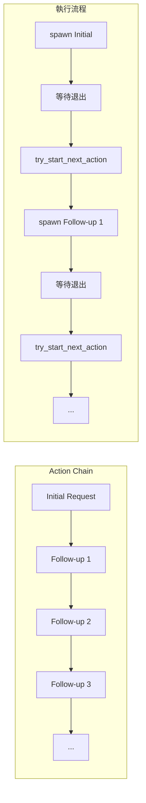
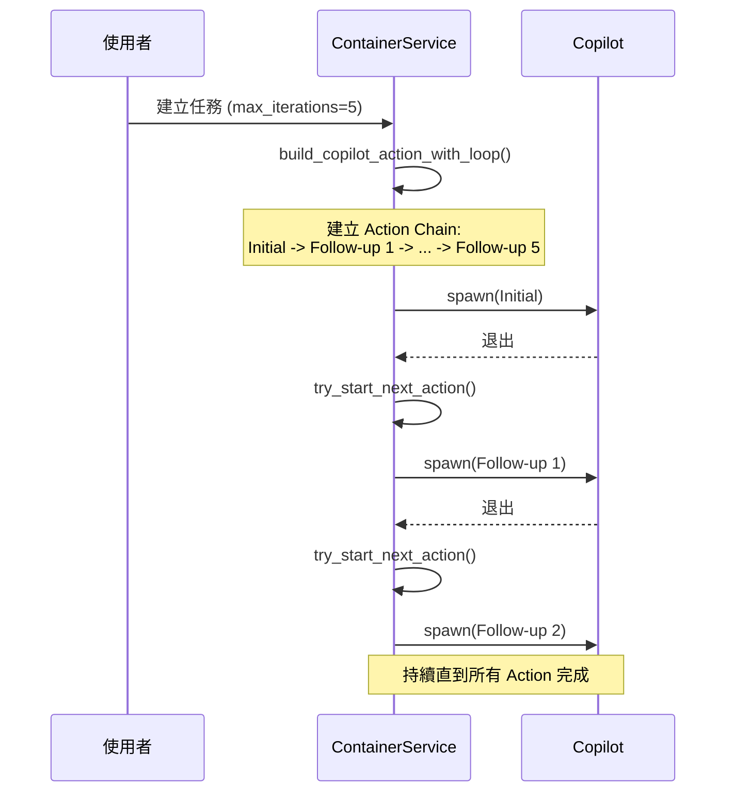
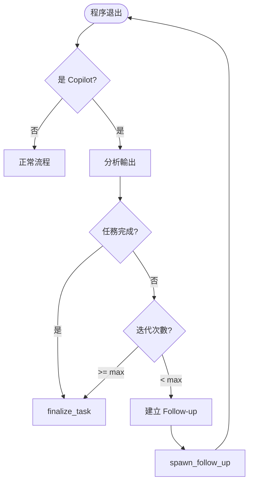
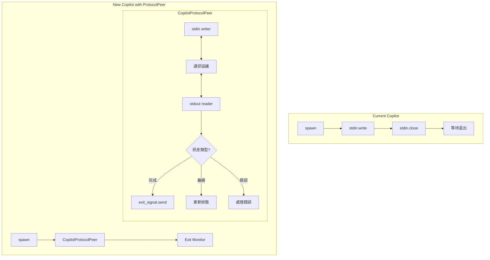
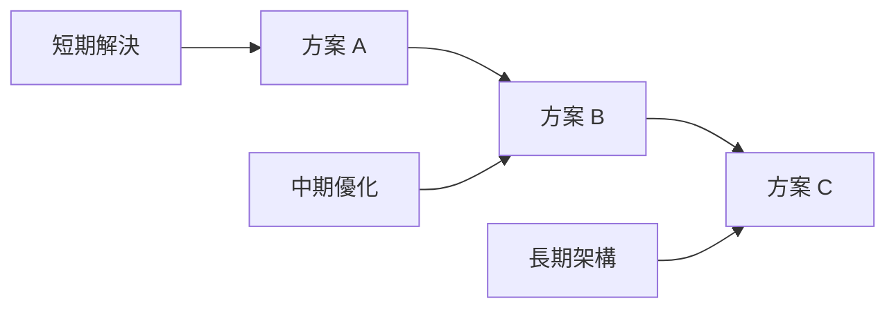

# Loop 循環解決方案

> **文件編號**: DOC-002
> **對應任務**: [D.01] 撰寫 05-loop-solution-proposal.md - Loop 循環解決方案
> **原始碼位置**: 待實作

## 問題陳述

**現象**: Copilot 執行約 15 分鐘後自動停止，即使任務尚未完成。

**根因**: Copilot 缺乏 Loop 機制，stdin 關閉後無法繼續通訊。

## 解決方案概覽

根據分析，提出以下三個可行方案：

| 方案 | 複雜度 | 影響範圍 | 推薦度 |
|------|--------|----------|--------|
| A. ExecutorAction Chain | 低 | 最小 | ⭐⭐⭐⭐⭐ |
| B. Exit + Auto Follow-up | 中 | 中等 | ⭐⭐⭐⭐ |
| C. ProtocolPeer 實作 | 高 | 大 | ⭐⭐ |

## 方案 A: ExecutorAction Chain (推薦)

### 概念

利用現有的 `ExecutorAction.next_action` 機制，在任務建立時預先串接多個 follow-up 動作。

### 架構圖



### 實作位置

**檔案**: `crates/services/src/services/workspace.rs` 或 `crates/services/src/actions/mod.rs`

### 程式碼範例

```rust
// 建立帶有預設 follow-up 鏈的 ExecutorAction
pub fn build_copilot_action_with_loop(
    initial_request: CodingAgentInitialRequest,
    max_iterations: usize,
    session_id: Option<String>,
) -> ExecutorAction {
    let mut action = ExecutorAction::new(
        ExecutorActionType::CodingAgentInitialRequest(initial_request.clone()),
        None,
    );

    // 建立 follow-up 鏈
    let mut current = &mut action;
    for i in 0..max_iterations {
        let follow_up = ExecutorAction::new(
            ExecutorActionType::CodingAgentFollowUpRequest(CodingAgentFollowUpRequest {
                prompt: format!("繼續執行任務，這是第 {} 次 follow-up", i + 1),
                session_id: session_id.clone(),
                // ... 其他參數
            }),
            None,
        );
        current.set_next_action(Some(Box::new(follow_up)));
        current = current.next_action_mut().unwrap();
    }

    action
}
```

### 流程圖



### 優點

1. **最小修改**: 利用現有機制
2. **無需修改 Copilot Executor**: 不影響核心邏輯
3. **可配置**: 可設定最大迭代次數
4. **向後相容**: 不影響其他 Executor

### 缺點

1. **預先定義**: 需要預先決定迭代次數
2. **無智慧判斷**: 無法根據任務完成狀態自動停止

---

## 方案 B: Exit + Auto Follow-up

### 概念

在 `spawn_exit_monitor` 中，當 Copilot 退出時，自動判斷是否需要建立 follow-up。

### 架構圖



### 實作位置

**檔案**: `crates/local-deployment/src/container.rs`

### 程式碼範例

```rust
// 在 spawn_exit_monitor 中新增邏輯
async fn handle_copilot_exit(&self, ctx: &ExecutionContext) -> bool {
    // 檢查是否是 Copilot
    let is_copilot = matches!(
        ctx.execution_process.executor_action()?.typ(),
        ExecutorActionType::CodingAgentInitialRequest(req) if is_copilot_agent(&req)
    );

    if !is_copilot {
        return false;  // 不處理，走正常流程
    }

    // 分析輸出判斷是否完成
    let output = self.read_execution_output(ctx).await;
    let is_task_complete = self.analyze_copilot_completion(&output);

    if is_task_complete {
        return false;  // 任務完成，走正常 finalize 流程
    }

    // 檢查迭代次數
    let iteration_count = ctx.execution_process.get_metadata("copilot_iteration")
        .and_then(|v| v.parse::<usize>().ok())
        .unwrap_or(0);

    if iteration_count >= MAX_COPILOT_ITERATIONS {
        tracing::warn!("Copilot reached max iterations: {}", iteration_count);
        return false;  // 超過最大次數，結束
    }

    // 建立 Follow-up
    let session_id = self.get_copilot_session_id(ctx);
    let follow_up_action = self.build_follow_up_action(ctx, session_id, iteration_count + 1);

    self.start_execution(
        &ctx.workspace,
        &ctx.session,
        &follow_up_action,
        &ExecutionProcessRunReason::CodingAgent,
    ).await.ok();

    true  // 已處理，不走正常流程
}

fn analyze_copilot_completion(&self, output: &str) -> bool {
    // 分析輸出內容判斷任務是否完成
    // 可能的判斷方式：
    // 1. 檢查是否有明確的完成標記
    // 2. 檢查是否有錯誤訊息
    // 3. 分析最後幾行輸出

    let completion_markers = [
        "Task completed",
        "All done",
        "Successfully",
        // ... 更多標記
    ];

    completion_markers.iter().any(|marker| output.contains(marker))
}
```

### 優點

1. **智慧判斷**: 可根據輸出判斷是否繼續
2. **動態迭代**: 不需預先定義次數
3. **集中管理**: 邏輯集中在 container

### 缺點

1. **需要修改核心**: 影響 container.rs
2. **判斷複雜**: 完成判斷邏輯可能不準確
3. **特殊處理**: 需要為 Copilot 特別處理

---

## 方案 C: ProtocolPeer 實作 (長期方案)

### 概念

為 Copilot 實作類似 Claude Code 的 ProtocolPeer 層，實現完整雙向通訊。

### 架構圖



### 實作位置

**新增檔案**: `crates/executors/src/executors/copilot_protocol.rs`

### 程式碼框架

```rust
// copilot_protocol.rs
pub struct CopilotProtocolPeer {
    stdin: ChildStdin,
    stdout: BufReader<ChildStdout>,
    exit_tx: Option<oneshot::Sender<ExecutorExitResult>>,
    interrupt_rx: oneshot::Receiver<()>,
}

impl CopilotProtocolPeer {
    pub async fn spawn(
        mut child: AsyncGroupChild,
        prompt: String,
    ) -> (Self, ExecutorExitSignal, InterruptSender) {
        let stdin = child.inner().stdin.take().unwrap();
        let stdout = BufReader::new(child.inner().stdout.take().unwrap());

        let (exit_tx, exit_rx) = oneshot::channel();
        let (interrupt_tx, interrupt_rx) = oneshot::channel();

        let peer = Self {
            stdin,
            stdout,
            exit_tx: Some(exit_tx),
            interrupt_rx,
        };

        (peer, exit_rx, interrupt_tx)
    }

    pub async fn run(&mut self, initial_prompt: &str) -> Result<(), ExecutorError> {
        // 發送初始 prompt
        self.send_prompt(initial_prompt).await?;

        // 進入 read loop
        self.read_loop().await
    }

    async fn read_loop(&mut self) -> Result<(), ExecutorError> {
        let mut buffer = String::new();

        loop {
            buffer.clear();
            tokio::select! {
                line_result = self.stdout.read_line(&mut buffer) => {
                    match line_result {
                        Ok(0) => {
                            // EOF - Copilot 結束
                            self.signal_exit(ExecutorExitResult::Success);
                            break;
                        }
                        Ok(_) => {
                            // 分析輸出
                            if self.should_continue(&buffer) {
                                // 發送 follow-up prompt
                                self.send_follow_up().await?;
                            } else if self.is_complete(&buffer) {
                                self.signal_exit(ExecutorExitResult::Success);
                                break;
                            }
                        }
                        Err(_) => {
                            self.signal_exit(ExecutorExitResult::Failure);
                            break;
                        }
                    }
                }
                _ = &mut self.interrupt_rx => {
                    // 收到中斷訊號
                    self.signal_exit(ExecutorExitResult::Success);
                    break;
                }
            }
        }
        Ok(())
    }

    fn should_continue(&self, output: &str) -> bool {
        // 判斷是否需要繼續
        !self.is_complete(output) && !self.has_error(output)
    }

    fn is_complete(&self, output: &str) -> bool {
        // 判斷任務是否完成
        output.contains("Task completed") ||
        output.contains("All done")
    }

    async fn send_follow_up(&mut self) -> Result<(), ExecutorError> {
        // 發送 follow-up prompt
        self.stdin.write_all(b"continue\n").await?;
        Ok(())
    }

    fn signal_exit(&mut self, result: ExecutorExitResult) {
        if let Some(tx) = self.exit_tx.take() {
            let _ = tx.send(result);
        }
    }
}
```

### 修改 Copilot Executor

```rust
// copilot.rs 修改
impl StandardCodingAgentExecutor for Copilot {
    async fn spawn(&self, ...) -> Result<SpawnedChild, ExecutorError> {
        // ... 現有建立 command 邏輯 ...

        let mut child = command.group_spawn()?;

        // 新增: 使用 CopilotProtocolPeer
        let (peer, exit_rx, interrupt_tx) = CopilotProtocolPeer::spawn(
            child,
            combined_prompt.clone(),
        );

        tokio::spawn(async move {
            peer.run(&combined_prompt).await
        });

        Ok(SpawnedChild {
            child,
            exit_signal: Some(exit_rx),        // ✅ 現在有了
            interrupt_sender: Some(interrupt_tx), // ✅ 現在有了
        })
    }
}
```

### 優點

1. **完整解決方案**: 實現真正的雙向通訊
2. **智慧判斷**: 可根據輸出動態決定
3. **標準化**: 與 Claude Code 架構一致
4. **可擴展**: 未來可支援更多功能

### 缺點

1. **實作複雜**: 需要深入理解 Copilot CLI
2. **測試困難**: 需要完整測試
3. **維護成本**: 增加維護負擔
4. **Copilot CLI 限制**: 可能不支援持續通訊

---

## 推薦實作順序



### 第一階段: 方案 A (立即可用)

1. 修改任務建立邏輯
2. 預設建立 5-10 個 follow-up 動作
3. 測試驗證

### 第二階段: 方案 B (增強判斷)

1. 在 container 新增 Copilot 特殊處理
2. 實作完成判斷邏輯
3. 新增配置項

### 第三階段: 方案 C (完整重構)

1. 研究 Copilot CLI 通訊能力
2. 實作 CopilotProtocolPeer
3. 完整測試

## 配置建議

```toml
# config.toml
[copilot]
# 方案 A: 預設 follow-up 次數
default_follow_up_count = 5

# 方案 B: 最大迭代次數
max_iterations = 10

# 完成判斷關鍵字
completion_markers = ["Task completed", "All done", "Successfully"]

# 錯誤判斷關鍵字
error_markers = ["Error:", "Failed:", "Exception:"]
```

## 結論

建議採用**方案 A** 作為短期解決方案，快速解決 Copilot 15 分鐘停止的問題。後續可根據使用情況，逐步實作方案 B 和方案 C 進行優化。

---

*上一章節: [04-comparison-with-claude.md](./04-comparison-with-claude.md) - 與 Claude Code 差異比較*
