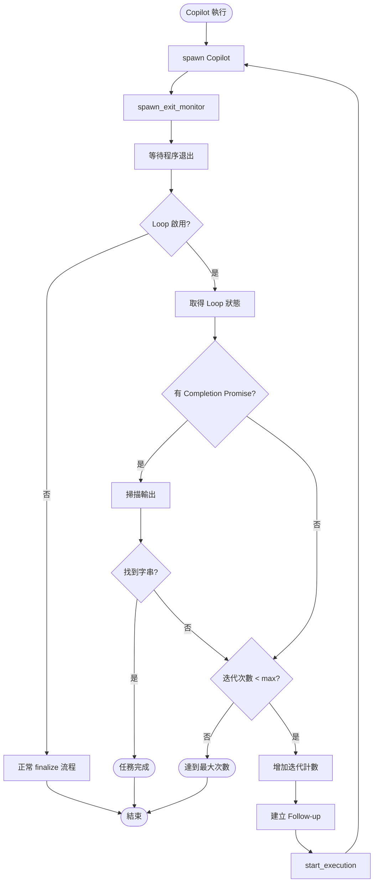
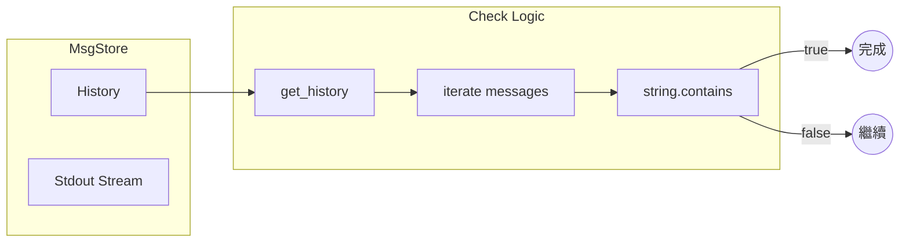

# Copilot Loop 功能實作計劃

> **文件編號**: DOC-002-PLAN
> **版本**: 1.0
> **日期**: 2026-01-16
> **參考**: [ralph-wiggum README](https://github.com/anthropics/claude-code/blob/main/plugins/ralph-wiggum/README.md)

## 1. 功能概述

### 1.1 目標
實現 Copilot 自動循環機制，當任務未完成時自動重啟 follow-up，直到：
1. 偵測到自定義的「完成字串」(Completion Promise)
2. 達到最大循環次數 (Max Iterations)

### 1.2 參考 Ralph-Wiggum 設計

```bash
# Ralph-Wiggum 的參數控制方式
/ralph-loop "<prompt>" --max-iterations <n> --completion-promise "<text>"
```

**核心概念**:
- `--max-iterations`: 安全機制，防止無限循環
- `--completion-promise`: 完成偵測，精確字串匹配

---

## 2. 架構設計

### 2.1 新增參數結構

```rust
// crates/executors/src/executors/copilot.rs
#[derive(Debug, Clone, Serialize, Deserialize, PartialEq, TS, JsonSchema)]
pub struct Copilot {
    // ... 現有欄位 ...

    /// 啟用 Loop 循環功能
    #[serde(default, skip_serializing_if = "Option::is_none")]
    pub loop_enabled: Option<bool>,

    /// 最大循環次數 (預設: 5)
    #[serde(default, skip_serializing_if = "Option::is_none")]
    pub max_iterations: Option<u32>,

    /// 完成字串 (精確匹配)
    #[serde(default, skip_serializing_if = "Option::is_none")]
    pub completion_promise: Option<String>,
}
```

### 2.2 TypeScript Types 更新

```typescript
// shared/types.ts (自動生成)
export type Copilot = {
  append_prompt: AppendPrompt,
  model?: string | null,
  allow_all_tools?: boolean | null,
  // ... 現有欄位 ...

  // 新增欄位
  loop_enabled?: boolean | null,
  max_iterations?: number | null,
  completion_promise?: string | null,
};
```

### 2.3 JSON Schema 更新

```json
// shared/schemas/copilot.json
{
  "properties": {
    // ... 現有屬性 ...

    "loop_enabled": {
      "title": "Enable Loop",
      "description": "Enable automatic loop until task completion",
      "type": ["boolean", "null"],
      "default": false
    },
    "max_iterations": {
      "title": "Max Iterations",
      "description": "Maximum number of loop iterations (default: 5)",
      "type": ["integer", "null"],
      "minimum": 1,
      "maximum": 100,
      "default": 5
    },
    "completion_promise": {
      "title": "Completion Promise",
      "description": "Exact string that signals task completion (e.g., '<promise>COMPLETE</promise>')",
      "type": ["string", "null"],
      "default": null
    }
  }
}
```

---

## 3. 核心實作

### 3.1 Loop 狀態追蹤

新增 Loop 狀態追蹤結構：

```rust
// crates/local-deployment/src/loop_tracker.rs (新檔案)
use std::collections::HashMap;
use std::sync::Arc;
use tokio::sync::RwLock;
use uuid::Uuid;

#[derive(Debug, Clone)]
pub struct CopilotLoopState {
    /// 當前迭代次數
    pub iteration: u32,
    /// 最大迭代次數
    pub max_iterations: u32,
    /// 完成字串
    pub completion_promise: Option<String>,
    /// 原始 prompt
    pub original_prompt: String,
    /// Session ID
    pub session_id: String,
    /// Executor Profile ID
    pub executor_profile_id: ExecutorProfileId,
}

pub struct CopilotLoopTracker {
    states: RwLock<HashMap<Uuid, CopilotLoopState>>,
}

impl CopilotLoopTracker {
    pub fn new() -> Self {
        Self {
            states: RwLock::new(HashMap::new()),
        }
    }

    pub async fn start_loop(&self, workspace_id: Uuid, state: CopilotLoopState) {
        self.states.write().await.insert(workspace_id, state);
    }

    pub async fn get_state(&self, workspace_id: &Uuid) -> Option<CopilotLoopState> {
        self.states.read().await.get(workspace_id).cloned()
    }

    pub async fn increment(&self, workspace_id: &Uuid) -> Option<u32> {
        let mut states = self.states.write().await;
        if let Some(state) = states.get_mut(workspace_id) {
            state.iteration += 1;
            Some(state.iteration)
        } else {
            None
        }
    }

    pub async fn remove(&self, workspace_id: &Uuid) {
        self.states.write().await.remove(workspace_id);
    }
}
```

### 3.2 完成偵測邏輯

在 `spawn_exit_monitor` 中新增完成偵測：

```rust
// crates/local-deployment/src/container.rs
// 在 spawn_exit_monitor 的 finalize 判斷前新增

impl LocalContainer {
    /// 檢查輸出是否包含完成字串
    async fn check_completion_promise(
        &self,
        exec_id: &Uuid,
        completion_promise: &str,
    ) -> bool {
        if let Some(msg_store) = self.msg_stores.read().await.get(exec_id) {
            let history = msg_store.get_history();
            for msg in history {
                if let LogMsg::Stdout(content) = msg {
                    if content.contains(completion_promise) {
                        tracing::info!(
                            "Completion promise '{}' detected in output",
                            completion_promise
                        );
                        return true;
                    }
                }
            }
        }
        false
    }

    /// 處理 Copilot Loop 邏輯
    async fn handle_copilot_loop(
        &self,
        ctx: &ExecutionContext,
        exec_id: &Uuid,
    ) -> Result<bool, ContainerError> {
        // 1. 檢查是否是 Copilot 且啟用 Loop
        let loop_state = match self.loop_tracker.get_state(&ctx.workspace.id).await {
            Some(state) => state,
            None => return Ok(false), // 未啟用 Loop
        };

        // 2. 檢查完成字串
        if let Some(ref promise) = loop_state.completion_promise {
            if self.check_completion_promise(exec_id, promise).await {
                tracing::info!(
                    "Copilot Loop completed: completion promise detected (iteration {})",
                    loop_state.iteration
                );
                self.loop_tracker.remove(&ctx.workspace.id).await;
                return Ok(false); // 任務完成，不需要繼續 Loop
            }
        }

        // 3. 檢查迭代次數
        if loop_state.iteration >= loop_state.max_iterations {
            tracing::warn!(
                "Copilot Loop reached max iterations: {} >= {}",
                loop_state.iteration,
                loop_state.max_iterations
            );
            self.loop_tracker.remove(&ctx.workspace.id).await;
            return Ok(false); // 達到最大次數，結束
        }

        // 4. 增加迭代計數並啟動 Follow-up
        let new_iteration = self.loop_tracker.increment(&ctx.workspace.id).await
            .unwrap_or(loop_state.iteration + 1);

        tracing::info!(
            "Copilot Loop: starting iteration {} of {}",
            new_iteration,
            loop_state.max_iterations
        );

        // 5. 建立 Follow-up 請求
        let follow_up_prompt = format!(
            "{}\n\n[System: This is iteration {} of {}. Continue the task.]",
            loop_state.original_prompt,
            new_iteration,
            loop_state.max_iterations
        );

        let follow_up_request = CodingAgentFollowUpRequest {
            prompt: follow_up_prompt,
            session_id: loop_state.session_id.clone(),
            executor_profile_id: loop_state.executor_profile_id.clone(),
            working_dir: None,
        };

        let follow_up_action = ExecutorAction::new(
            ExecutorActionType::CodingAgentFollowUpRequest(follow_up_request),
            None,
        );

        // 6. 啟動 Follow-up
        self.start_execution(
            &ctx.workspace,
            &ctx.session,
            &follow_up_action,
            &ExecutionProcessRunReason::CodingAgent,
        ).await?;

        Ok(true) // 已啟動新的迭代
    }
}
```

### 3.3 修改 spawn_exit_monitor

```rust
// crates/local-deployment/src/container.rs
// 在 should_finalize 判斷前插入 Loop 處理

// ... 在 if container.should_finalize(&ctx) { 之前 ...

// === Copilot Loop 處理 ===
let handled_by_loop = match container.handle_copilot_loop(&ctx, &exec_id).await {
    Ok(handled) => handled,
    Err(e) => {
        tracing::error!("Failed to handle Copilot loop: {}", e);
        false
    }
};

if handled_by_loop {
    // Loop 已處理，跳過正常 finalize 流程
    return;
}
// === Copilot Loop 處理結束 ===

if container.should_finalize(&ctx) {
    // ... 原有邏輯 ...
}
```

---

## 4. UI 實作

### 4.1 設定面板

**位置**: `frontend/src/pages/settings/AgentSettings.tsx`

新增 Copilot Loop 設定區塊：

```tsx
// frontend/src/components/settings/CopilotLoopSettings.tsx (新檔案)
import { useState } from 'react';
import { Card, CardContent, CardHeader, CardTitle } from '@/components/ui/card';
import { Switch } from '@/components/ui/switch';
import { Input } from '@/components/ui/input';
import { Label } from '@/components/ui/label';
import { Slider } from '@/components/ui/slider';

interface CopilotLoopSettingsProps {
  value: {
    loop_enabled?: boolean;
    max_iterations?: number;
    completion_promise?: string;
  };
  onChange: (value: CopilotLoopSettingsProps['value']) => void;
}

export function CopilotLoopSettings({ value, onChange }: CopilotLoopSettingsProps) {
  return (
    <Card>
      <CardHeader>
        <CardTitle className="flex items-center gap-2">
          <span>🔄</span>
          Loop Settings
        </CardTitle>
      </CardHeader>
      <CardContent className="space-y-4">
        {/* 啟用 Loop */}
        <div className="flex items-center justify-between">
          <Label htmlFor="loop-enabled">Enable Auto Loop</Label>
          <Switch
            id="loop-enabled"
            checked={value.loop_enabled ?? false}
            onCheckedChange={(checked) =>
              onChange({ ...value, loop_enabled: checked })
            }
          />
        </div>

        {value.loop_enabled && (
          <>
            {/* 最大迭代次數 */}
            <div className="space-y-2">
              <Label>Max Iterations: {value.max_iterations ?? 5}</Label>
              <Slider
                value={[value.max_iterations ?? 5]}
                onValueChange={([val]) =>
                  onChange({ ...value, max_iterations: val })
                }
                min={1}
                max={50}
                step={1}
              />
              <p className="text-xs text-muted-foreground">
                Safety limit to prevent infinite loops
              </p>
            </div>

            {/* 完成字串 */}
            <div className="space-y-2">
              <Label htmlFor="completion-promise">Completion Promise</Label>
              <Input
                id="completion-promise"
                placeholder="e.g., <promise>COMPLETE</promise>"
                value={value.completion_promise ?? ''}
                onChange={(e) =>
                  onChange({ ...value, completion_promise: e.target.value || undefined })
                }
              />
              <p className="text-xs text-muted-foreground">
                Exact string that signals task completion. Leave empty to rely only on max iterations.
              </p>
            </div>
          </>
        )}
      </CardContent>
    </Card>
  );
}
```

### 4.2 JSON Schema UI 整合

更新 `copilot.json` schema 以支援 rjsf 表單：

```json
{
  "properties": {
    "loop_enabled": {
      "title": "🔄 Enable Loop",
      "description": "Enable automatic loop until task completion",
      "type": ["boolean", "null"],
      "default": false,
      "ui:widget": "switch"
    },
    "max_iterations": {
      "title": "Max Iterations",
      "description": "Maximum number of loop iterations",
      "type": ["integer", "null"],
      "minimum": 1,
      "maximum": 100,
      "default": 5,
      "ui:widget": "range",
      "ui:options": {
        "dependency": {
          "loop_enabled": true
        }
      }
    },
    "completion_promise": {
      "title": "Completion Promise",
      "description": "Exact string that signals task completion",
      "type": ["string", "null"],
      "default": null,
      "ui:placeholder": "<promise>COMPLETE</promise>",
      "ui:options": {
        "dependency": {
          "loop_enabled": true
        }
      }
    }
  }
}
```

---

## 5. 實作順序

### Phase A: Backend 核心 (預估 2-3 天)

| 順序 | 任務 | 檔案 | 複雜度 |
|------|------|------|--------|
| A.01 | 新增 Copilot struct 欄位 | `copilot.rs` | 低 |
| A.02 | 更新 JSON Schema | `copilot.json` | 低 |
| A.03 | 執行 `pnpm run generate-types` | - | 低 |
| A.04 | 建立 `CopilotLoopTracker` | `loop_tracker.rs` (新) | 中 |
| A.05 | 實作 `check_completion_promise()` | `container.rs` | 中 |
| A.06 | 實作 `handle_copilot_loop()` | `container.rs` | 高 |
| A.07 | 修改 `spawn_exit_monitor` | `container.rs` | 中 |
| A.08 | 初始化時建立 Loop 狀態 | `container.rs` | 中 |

### Phase B: Frontend UI (預估 1-2 天)

| 順序 | 任務 | 檔案 | 複雜度 |
|------|------|------|--------|
| B.01 | 建立 `CopilotLoopSettings` 元件 | `CopilotLoopSettings.tsx` (新) | 中 |
| B.02 | 整合到 `AgentSettings` 頁面 | `AgentSettings.tsx` | 低 |
| B.03 | 更新 i18n 翻譯 | `settings.json` | 低 |
| B.04 | 測試 UI 互動 | - | 低 |

### Phase C: 測試與驗證 (預估 1 天)

| 順序 | 任務 | 說明 |
|------|------|------|
| C.01 | 單元測試 | 測試完成偵測邏輯 |
| C.02 | 整合測試 | 測試完整 Loop 流程 |
| C.03 | QA 測試 | 使用 `pnpm run dev:qa` |
| C.04 | 文件更新 | 更新使用說明 |

---

## 6. 流程圖

### 6.1 整體流程



### 6.2 完成偵測流程



---

## 7. 測試案例

### 7.1 單元測試

```rust
#[cfg(test)]
mod tests {
    use super::*;

    #[test]
    fn test_completion_promise_detection() {
        let output = "Working on task...\n<promise>COMPLETE</promise>\nDone.";
        let promise = "<promise>COMPLETE</promise>";
        assert!(output.contains(promise));
    }

    #[test]
    fn test_max_iterations_limit() {
        let state = CopilotLoopState {
            iteration: 5,
            max_iterations: 5,
            completion_promise: None,
            original_prompt: "test".to_string(),
            session_id: "test-session".to_string(),
            executor_profile_id: ExecutorProfileId::new(BaseCodingAgent::Copilot),
        };
        assert!(state.iteration >= state.max_iterations);
    }
}
```

### 7.2 整合測試場景

| 場景 | 輸入 | 預期結果 |
|------|------|----------|
| 正常完成 | `completion_promise="DONE"`, 輸出包含 "DONE" | 1 次迭代後結束 |
| 最大迭代 | `max_iterations=3`, 無完成字串 | 3 次迭代後結束 |
| 停用 Loop | `loop_enabled=false` | 正常單次執行 |
| 空完成字串 | `completion_promise=null` | 依賴 max_iterations |

---

## 8. 風險與緩解

| 風險 | 影響 | 緩解措施 |
|------|------|----------|
| 無限循環 | 資源耗盡 | `max_iterations` 硬上限 (100) |
| 誤判完成 | 提前結束 | 使用唯一完成字串如 `<promise>COMPLETE</promise>` |
| 輸出過大 | 記憶體溢出 | MsgStore 已有 100MB 限制 |
| 並發問題 | 狀態不一致 | 使用 `RwLock` 保護狀態 |

---

## 9. 預設值建議

```rust
impl Default for CopilotLoopConfig {
    fn default() -> Self {
        Self {
            loop_enabled: false,
            max_iterations: 5,
            completion_promise: Some("<promise>COMPLETE</promise>".to_string()),
        }
    }
}
```

**使用者提示語建議**:

```
完成任務後，請輸出 <promise>COMPLETE</promise> 標記。
若無法完成，請說明原因並繼續嘗試。
```

---

## 10. 參考資料

- [Ralph-Wiggum Plugin](https://github.com/anthropics/claude-code/blob/main/plugins/ralph-wiggum/README.md)
- [Copilot 執行流程概述](./01-overview.md)
- [退出監控機制](./03-exit-monitoring.md)
- [Loop 循環解決方案](./05-loop-solution-proposal.md)

---

*文件結束*
