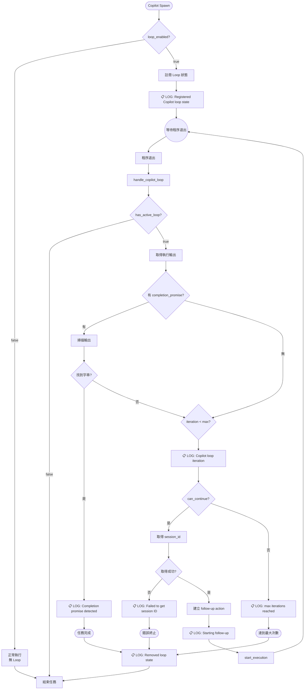

# Copilot Loop 功能規格書

> **版本**: 1.1.0
> **最後更新**: 2026-01-23
> **適用範圍**: Code Review 基礎依據

---

## 1. 概述 (Overview)

### 1.1 功能目的

Copilot Loop 是一個自動重試機制，允許 Copilot executor 在任務未完成時自動發送 follow-up 請求，直到：
1. 偵測到 **completion promise** 字串（任務成功完成）
2. 達到 **max_iterations** 上限（強制終止）

### 1.2 設計原則

- **非侵入式**: Loop 機制獨立於核心執行流程，透過 hook 點整合
- **可觀察性**: 每個關鍵狀態變化都有 tracing log
- **容錯性**: 任何錯誤都會安全終止 loop 並清理狀態
- **可配置性**: 透過 UI 或 JSON 配置啟用/停用

### 1.3 核心檔案

| 檔案路徑 | 職責 |
|---------|------|
| `crates/executors/src/executors/copilot.rs` | Copilot struct 定義，包含 loop 配置欄位 |
| `crates/local-deployment/src/loop_tracker.rs` | Loop 狀態追蹤器 |
| `crates/local-deployment/src/container.rs` | Loop 註冊與處理邏輯 |

---

## 2. 資料結構規格 (Data Structures)

### 2.1 Copilot Configuration Fields

**位置**: `crates/executors/src/executors/copilot.rs:54-73`

```rust
pub struct Copilot {
    // ... 其他欄位省略 ...

    /// 是否啟用 Loop 功能
    /// - `None` 或 `Some(false)`: 停用
    /// - `Some(true)`: 啟用
    #[serde(default, skip_serializing_if = "Option::is_none")]
    pub loop_enabled: Option<bool>,

    /// 最大迭代次數
    /// - 預設值: 5
    /// - 最小值: 1
    /// - 最大值: 100
    #[serde(default, skip_serializing_if = "Option::is_none")]
    pub max_iterations: Option<u32>,

    /// 完成標記字串
    /// - 例如: `<promise>COMPLETE</promise>`
    /// - 當輸出中包含此字串時，視為任務完成
    #[serde(default, skip_serializing_if = "Option::is_none")]
    pub completion_promise: Option<String>,
}
```

**規格約束**:
- `loop_enabled`: 布林值，`None` 等同於 `false`
- `max_iterations`: 範圍 `[1, 100]`，超出範圍將被 clamp
- `completion_promise`: 區分大小寫的精確字串匹配

---

### 2.2 CopilotLoopState

**位置**: `crates/local-deployment/src/loop_tracker.rs:13-30`

```rust
#[derive(Debug, Clone)]
pub struct CopilotLoopState {
    /// 當前迭代次數（從 0 開始）
    pub iteration: u32,

    /// 允許的最大迭代次數
    pub max_iterations: u32,

    /// 完成標記字串（可選）
    pub completion_promise: Option<String>,

    /// 原始 prompt（用於建構 follow-up）
    pub original_prompt: String,

    /// Copilot session ID
    pub session_id: String,

    /// Executor profile ID（用於建立 follow-up 請求）
    pub executor_profile_id: ExecutorProfileId,

    /// 工作目錄（可選）
    pub working_dir: Option<String>,
}
```

**狀態不變量 (Invariants)**:
- `iteration <= max_iterations` 始終為真
- `iteration` 只會遞增，永不重置
- `session_id` 可能在首次執行後更新

---

### 2.3 CopilotLoopTracker

**位置**: `crates/local-deployment/src/loop_tracker.rs:49-54`

```rust
#[derive(Debug, Clone, Default)]
pub struct CopilotLoopTracker {
    /// workspace_id -> CopilotLoopState 的映射
    states: Arc<RwLock<HashMap<Uuid, CopilotLoopState>>>,
}
```

**執行緒安全**:
- 使用 `RwLock` 保護並發存取
- 所有方法皆為 `async` 並正確取得鎖

---

## 3. 狀態機規格 (State Machine)

### 3.1 狀態定義

```
┌─────────────────────────────────────────────────────────────────┐
│                        Copilot Loop FSM                          │
├─────────────────────────────────────────────────────────────────┤
│                                                                  │
│  [UNREGISTERED] ──(start_execution + loop_enabled)──▶ [ACTIVE]  │
│                                                                  │
│  [ACTIVE] ──(completion_promise detected)──▶ [COMPLETED]        │
│  [ACTIVE] ──(iteration >= max_iterations)──▶ [MAX_REACHED]      │
│  [ACTIVE] ──(error)──▶ [ERROR]                                  │
│  [ACTIVE] ──(follow-up started)──▶ [ACTIVE] (iteration++)       │
│                                                                  │
│  [COMPLETED] ──(cleanup)──▶ [UNREGISTERED]                      │
│  [MAX_REACHED] ──(cleanup)──▶ [UNREGISTERED]                    │
│  [ERROR] ──(cleanup)──▶ [UNREGISTERED]                          │
│                                                                  │
└─────────────────────────────────────────────────────────────────┘
```

### 3.2 狀態轉換表

| 當前狀態 | 事件 | 下一狀態 | 動作 |
|---------|------|---------|------|
| UNREGISTERED | `start_execution` (loop_enabled=true) | ACTIVE | 呼叫 `register()` |
| ACTIVE | `handle_copilot_loop` (promise found) | COMPLETED | 呼叫 `remove()` |
| ACTIVE | `handle_copilot_loop` (iteration >= max) | MAX_REACHED | 呼叫 `remove()` |
| ACTIVE | `handle_copilot_loop` (can_continue) | ACTIVE | 遞增 iteration, spawn follow-up |
| ACTIVE | 任何錯誤 | ERROR | 呼叫 `remove()` |
| COMPLETED | - | UNREGISTERED | 自動清理 |
| MAX_REACHED | - | UNREGISTERED | 自動清理 |
| ERROR | - | UNREGISTERED | 自動清理 |

### 3.3 流程圖



---

## 4. API 介面規格 (Interfaces)

### 4.1 CopilotLoopTracker Public Methods

#### 4.1.1 `new()`

```rust
pub fn new() -> Self
```

**描述**: 建立新的空白追蹤器
**複雜度**: O(1)
**執行緒安全**: 是

---

#### 4.1.2 `register()`

```rust
pub async fn register(
    &self,
    workspace_id: Uuid,
    max_iterations: u32,
    completion_promise: Option<String>,
    original_prompt: String,
    session_id: String,
    executor_profile_id: ExecutorProfileId,
    working_dir: Option<String>,
)
```

**描述**: 為指定 workspace 註冊新的 loop 狀態

**前置條件**:
- `workspace_id` 不應已存在於 tracker 中（否則會覆蓋）

**後置條件**:
- `states` map 包含 `workspace_id` 的新狀態
- 狀態的 `iteration` 為 0

**Log 輸出**:
```
INFO Registered Copilot loop state for workspace {workspace_id}: max_iterations={max_iterations}
```

---

#### 4.1.3 `get()`

```rust
pub async fn get(&self, workspace_id: &Uuid) -> Option<CopilotLoopState>
```

**描述**: 取得指定 workspace 的 loop 狀態
**返回**: `Some(state)` 或 `None`（如果不存在）

---

#### 4.1.4 `update_session_id()`

```rust
pub async fn update_session_id(&self, workspace_id: &Uuid, session_id: String)
```

**描述**: 更新指定 workspace 的 session ID
**備註**: 如果 workspace 不存在，此操作為 no-op

---

#### 4.1.5 `increment_and_check()`

```rust
pub async fn increment_and_check(&self, workspace_id: &Uuid) -> bool
```

**描述**: 遞增迭代計數並檢查是否可繼續

**返回**:
- `true`: 可以繼續（`iteration < max_iterations`）
- `false`: 不可繼續或 workspace 不存在

**副作用**: `iteration += 1`

**Log 輸出**:
```
INFO Copilot loop iteration {iteration} of {max_iterations} for workspace {workspace_id} (can_continue={can_continue})
```

---

#### 4.1.6 `remove()`

```rust
pub async fn remove(&self, workspace_id: &Uuid)
```

**描述**: 移除指定 workspace 的 loop 狀態

**Log 輸出** (僅當狀態存在時):
```
INFO Removed Copilot loop state for workspace {workspace_id}
```

---

#### 4.1.7 `has_active_loop()`

```rust
pub async fn has_active_loop(&self, workspace_id: &Uuid) -> bool
```

**描述**: 檢查指定 workspace 是否有活躍的 loop
**返回**: `true` 或 `false`

---

#### 4.1.8 `get_completion_promise()`

```rust
pub async fn get_completion_promise(&self, workspace_id: &Uuid) -> Option<String>
```

**描述**: 取得指定 workspace 的 completion promise 字串
**返回**: `Some(promise)` 或 `None`

---

### 4.2 Standalone Functions

#### 4.2.1 `check_completion_promise()`

```rust
pub fn check_completion_promise(output: &str, completion_promise: &str) -> bool
```

**描述**: 檢查輸出中是否包含 completion promise 字串

**參數**:
- `output`: 要搜尋的文字內容
- `completion_promise`: 要尋找的字串

**返回**:
- `true`: 找到字串
- `false`: 未找到或 `completion_promise` 為空

**Log 輸出** (僅當找到時):
```
INFO Completion promise '{completion_promise}' detected in output
```

**實作細節**:
- 使用 `output.contains(completion_promise)`
- 區分大小寫
- 空字串 promise 永遠返回 `false`

---

### 4.3 CopilotLoopState Methods

#### 4.3.1 `can_continue()`

```rust
pub fn can_continue(&self) -> bool
```

**返回**: `self.iteration < self.max_iterations`

---

#### 4.3.2 `increment()`

```rust
pub fn increment(&mut self)
```

**副作用**: `self.iteration += 1`

---

#### 4.3.3 `build_follow_up_prompt()`

```rust
pub fn build_follow_up_prompt(&self) -> String
```

**返回**: `format!("{}\n\n繼續", self.original_prompt)`

**備註**: Follow-up prompt 會在原始 prompt 後附加 `\n\n繼續`

---

## 5. 邊界條件與約束 (Boundary Conditions & Constraints)

### 5.1 配置驗證

| 欄位 | 驗證規則 | 預設值 | 處理方式 |
|-----|---------|-------|---------|
| `loop_enabled` | 布林值 | `false` | `unwrap_or(false)` |
| `max_iterations` | 1 ≤ x ≤ 100 | 5 | `unwrap_or(5).min(100).max(1)` |
| `completion_promise` | 非空字串 | `None` | 空字串視為無效 |

**位置**: `container.rs:912`
```rust
let max_iterations = copilot.max_iterations.unwrap_or(5).min(100).max(1);
```

### 5.2 只對特定 Executor 啟用

```rust
// container.rs:890-892
if initial_request.executor_profile_id.executor != BaseCodingAgent::Copilot {
    return;
}
```

**規格**: Loop 功能**僅限** `Copilot` executor，其他 executor（如 Claude Code、Gemini 等）不支援。

### 5.3 只對 Initial Request 啟用

```rust
// container.rs:885-887
let ExecutorActionType::CodingAgentInitialRequest(initial_request) = &executor_action.typ else {
    return;
};
```

**規格**: Loop 只在**初始請求**時註冊，**follow-up 請求不會重新註冊 loop**。

### 5.4 Workspace 唯一性

- 每個 `workspace_id` 最多只有一個活躍的 loop 狀態
- 重複註冊會覆蓋舊狀態（可能導致資料遺失）

### 5.5 Session ID 取得時機

```rust
// container.rs:985-996
let session_id = match self.get_session_id_from_msg_store(exec_id) {
    Some(id) => id,
    None => {
        tracing::error!(...);
        self.loop_tracker.remove(&ctx.workspace.id).await;
        return false;
    }
};
```

**規格**:
- Session ID 從 `MsgStore` 取得，而非使用註冊時的空字串
- 如果無法取得 session ID，loop 會被終止

---

## 6. 錯誤處理規格 (Error Handling)

### 6.1 錯誤類型與處理

| 錯誤場景 | Log 級別 | 處理方式 |
|---------|---------|---------|
| 無法取得 session ID | ERROR | 終止 loop，呼叫 `remove()` |
| 無法取得 repos | ERROR | 終止 loop，呼叫 `remove()` |
| `start_execution` 失敗 | ERROR | 終止 loop，呼叫 `remove()` |
| workspace 不存在於 tracker | - | 返回 `false`，不做任何動作 |

### 6.2 錯誤恢復

**原則**: 所有錯誤都會導致 loop 終止並清理狀態，不會嘗試重試。

```rust
// 典型錯誤處理模式
Err(e) => {
    tracing::error!("Error description: {}", e);
    self.loop_tracker.remove(&ctx.workspace.id).await;
    return false;
}
```

### 6.3 Log 訊息格式

| Log 訊息 | 級別 | 觸發條件 |
|---------|------|---------|
| `Registered Copilot loop state for workspace {}: max_iterations={}` | INFO | loop 註冊成功 |
| `Registering Copilot loop for workspace {}: max_iterations={}, completion_promise={:?}` | INFO | 開始註冊 loop |
| `Copilot loop iteration {} of {} for workspace {} (can_continue={})` | INFO | 迭代檢查 |
| `Completion promise '{}' detected in output` | INFO | 找到 completion promise |
| `Copilot loop complete: completion promise detected for workspace {}` | INFO | 因 promise 完成 |
| `Copilot loop complete: max iterations reached for workspace {}` | INFO | 因達到上限完成 |
| `Starting Copilot loop follow-up for workspace {} (iteration {})` | INFO | 開始 follow-up |
| `Removed Copilot loop state for workspace {}` | INFO | loop 狀態移除 |
| `Copilot loop cancelled: execution was {:?} for workspace {}` | INFO | 執行被停止/失敗時取消 loop |
| `Clearing Copilot loop state for workspace {} due to stop_execution` | INFO | 使用者手動停止時清除 loop |
| `Failed to get session ID from MsgStore for Copilot loop follow-up (workspace {})` | ERROR | session ID 取得失敗 |
| `Failed to get repos for Copilot loop follow-up: {}` | ERROR | repos 取得失敗 |
| `Failed to start Copilot loop follow-up: {}` | ERROR | follow-up 啟動失敗 |

---

## 7. 執行流程整合點 (Integration Points)

### 7.1 Hook 點一覽

```
┌─────────────────────────────────────────────────────────────────────────┐
│                    LocalContainerService Execution Flow                  │
├─────────────────────────────────────────────────────────────────────────┤
│                                                                          │
│  start_execution()                                                       │
│       │                                                                  │
│       ├──▶ spawn executor                                                │
│       │                                                                  │
│       ├──▶ [HOOK 1] try_register_copilot_loop()  ◀── 註冊 Loop          │
│       │                                                                  │
│       └──▶ spawn_exit_monitor()                                          │
│                  │                                                       │
│                  ▼                                                       │
│            (等待程序退出)   ◀────────────────────────────────────────┐   │
│                  │                                                   │   │
│    ┌─────────────┴─────────────┐                                     │   │
│    │                           │                                     │   │
│    ▼                           ▼                                     │   │
│  [STOP]                  [正常退出]                                   │   │
│  stop_execution()              │                                     │   │
│    │                           │                                     │   │
│    │                           ▼                                     │   │
│    │                [HOOK 2] handle_copilot_loop()                   │   │
│    │                     │                                           │   │
│    │      ┌──────────────┼──────────────┐                            │   │
│    │      ▼              ▼              ▼                            │   │
│    │  [Killed?]    [loop ok?]     [loop end]                         │   │
│    │      │              │              │                            │   │
│    │      ▼              │              │                            │   │
│    │  清除 loop 狀態      │              │                            │   │
│    │      │              │              │                            │   │
│    ▼      ▼              │              ▼                            │   │
│  清除 loop 狀態   ◀───────┘      finalize_task()                     │   │
│    │                     │                                           │   │
│    └──────▶ finalize_task()                                          │   │
│                          │                                           │   │
│                          └──(follow-up)──────────────────────────────┘   │
│                                                                          │
└─────────────────────────────────────────────────────────────────────────┘
```

### 7.2 停止機制（v1.1.0 新增）

當使用者點擊「停止」按鈕時，系統會：

1. **`stop_execution()` 主動清除 loop 狀態**：
   - 載入 execution context
   - 檢查是否有 active loop
   - 呼叫 `loop_tracker.remove()` 清除狀態
   - Log: `Clearing Copilot loop state for workspace {} due to stop_execution`

2. **`handle_copilot_loop()` 防禦性檢查**：
   - 檢查 `execution_process.status` 是否為 `Killed` 或 `Failed`
   - 如果是，清除 loop 狀態並返回 `false`
   - Log: `Copilot loop cancelled: execution was {:?} for workspace {}`

**雙重保險機制**：即使 `stop_execution()` 的清除未及時生效，`handle_copilot_loop()` 也會正確處理。

### 7.3 程式碼位置

| Hook | 檔案 | 行號 |
|------|------|------|
| `try_register_copilot_loop` 呼叫 | container.rs | ~1369 |
| `handle_copilot_loop` 呼叫 | container.rs | ~489 |
| `stop_execution` loop 清除 | container.rs | ~1413-1420 |
| `handle_copilot_loop` Killed 檢查 | container.rs | ~950-964 |

---

## 8. 測試驗收標準 (Acceptance Criteria)

### 8.1 單元測試案例

#### TC-LOOP-001: Loop Tracker 生命週期

**前置**: 建立空的 `CopilotLoopTracker`
**步驟**:
1. 註冊 loop 狀態（max_iterations=5）
2. 確認 `has_active_loop()` 返回 `true`
3. 確認 `iteration` 為 0
4. 呼叫 `increment_and_check()` 5 次
5. 確認第 5 次返回 `false`
6. 呼叫 `remove()`
7. 確認 `has_active_loop()` 返回 `false`

**預期**: 全部通過

**位置**: `loop_tracker.rs:164-197`

---

#### TC-LOOP-002: Completion Promise 偵測

**測試資料**:
```
output = "Task completed. <promise>COMPLETE-HUNTER</promise> Done."
promise = "<promise>COMPLETE-HUNTER</promise>"
```

**預期**:
- `check_completion_promise(output, promise)` 返回 `true`
- `check_completion_promise(output, "<promise>OTHER</promise>")` 返回 `false`
- `check_completion_promise(output, "")` 返回 `false`

**位置**: `loop_tracker.rs:199-208`

---

#### TC-LOOP-003: Follow-up Prompt 建構

**輸入**: `original_prompt = "Build the feature"`
**預期輸出**: `"Build the feature\n\n繼續"`

**位置**: `loop_tracker.rs:210-222`

---

### 8.2 整合測試案例

#### TC-INT-001: 完整 Loop 流程 - Promise 完成

**前置**:
1. 配置 Copilot: `loop_enabled=true`, `max_iterations=5`, `completion_promise="<promise>DONE</promise>"`
2. 建立測試 workspace

**步驟**:
1. 啟動 Copilot 任務
2. 第一次執行輸出不含 promise
3. 自動觸發 follow-up
4. 第二次執行輸出包含 `<promise>DONE</promise>`

**預期**:
- 觀察到 `Registered Copilot loop state` log
- 觀察到 `Copilot loop iteration 1 of 5` log
- 觀察到 `Starting Copilot loop follow-up` log
- 觀察到 `Completion promise detected` log
- 觀察到 `Removed Copilot loop state` log
- 總迭代次數: 2

---

#### TC-INT-002: 完整 Loop 流程 - Max Iterations

**前置**:
1. 配置 Copilot: `loop_enabled=true`, `max_iterations=3`, `completion_promise="<promise>DONE</promise>"`
2. 建立測試 workspace

**步驟**:
1. 啟動 Copilot 任務
2. 所有執行都不輸出 promise

**預期**:
- 觀察到 3 次 `Copilot loop iteration` log
- 觀察到 `max iterations reached` log
- 觀察到 `Removed Copilot loop state` log
- 總迭代次數: 3

---

#### TC-INT-003: Loop 未啟用

**前置**:
1. 配置 Copilot: `loop_enabled=false`
2. 建立測試 workspace

**步驟**:
1. 啟動 Copilot 任務
2. 執行完成

**預期**:
- **不應**觀察到 `Registered Copilot loop state` log
- 任務正常完成，無 follow-up

---

### 8.3 Code Review 檢查清單

#### CR-001: 資料結構

- [ ] `CopilotLoopState` 所有欄位都有文件說明
- [ ] `max_iterations` 有正確的範圍限制 `[1, 100]`
- [ ] `completion_promise` 空字串處理正確

#### CR-002: 狀態管理

- [ ] 所有 `loop_tracker` 方法正確使用 `async`/`await`
- [ ] `RwLock` 取得後及時釋放
- [ ] 沒有 deadlock 風險（不同時持有多個鎖）

#### CR-003: 錯誤處理

- [ ] 所有錯誤路徑都呼叫 `loop_tracker.remove()`
- [ ] 所有錯誤都有適當的 log 輸出
- [ ] 錯誤不會導致狀態洩漏

#### CR-004: 執行流程

- [ ] `try_register_copilot_loop` 只對 `CodingAgentInitialRequest` 執行
- [ ] `try_register_copilot_loop` 只對 `Copilot` executor 執行
- [ ] `handle_copilot_loop` 在程序退出後正確觸發
- [ ] follow-up 請求使用正確的 `session_id`
- [ ] `handle_copilot_loop` 檢查 `Killed`/`Failed` 狀態並清除 loop
- [ ] `stop_execution` 主動清除 loop 狀態

#### CR-005: 可觀察性

- [ ] 所有關鍵狀態變化都有 INFO 級別 log
- [ ] 所有錯誤都有 ERROR 級別 log
- [ ] Log 訊息包含足夠的上下文資訊（workspace_id, iteration 等）

#### CR-006: 測試覆蓋

- [ ] 單元測試覆蓋所有 public methods
- [ ] 測試覆蓋邊界條件（空字串 promise, max=1, max=100）
- [ ] 測試覆蓋錯誤路徑

---

## 9. 已知限制 (Known Limitations)

1. **僅支援 Copilot Executor**: 其他 coding agent 不支援 loop 功能
2. ~~**無法暫停/恢復**: 一旦開始，loop 只能透過 completion 或 max iterations 結束~~ **（v1.1.0 已支援使用者手動停止）**
3. **覆蓋行為**: 重複註冊會覆蓋舊狀態，可能導致資料遺失
4. **Session ID 依賴**: 如果無法取得 session ID，loop 會立即終止
5. **Follow-up Prompt 固定**: 目前 follow-up 只附加 `\n\n繼續`，無法自訂

---

## 10. 版本歷史

| 版本 | 日期 | 變更說明 |
|-----|------|---------|
| 1.1.0 | 2026-01-23 | 新增使用者停止機制支援、多 Session 隔離性驗證 |
| 1.0.0 | 2026-01-22 | 初始規格文件 |

---

## 附錄 A: JSON Schema

```json
{
  "$schema": "http://json-schema.org/draft-07/schema#",
  "title": "CopilotLoopConfig",
  "type": "object",
  "properties": {
    "loop_enabled": {
      "type": "boolean",
      "default": false,
      "description": "Enable automatic loop until task completion"
    },
    "max_iterations": {
      "type": "integer",
      "minimum": 1,
      "maximum": 100,
      "default": 5,
      "description": "Maximum number of loop iterations"
    },
    "completion_promise": {
      "type": "string",
      "description": "Exact string that signals task completion"
    }
  }
}
```

---

## 附錄 B: 觀察 Loop 執行的指令

```bash
# 啟動帶有 debug log 的 backend
RUST_LOG=debug pnpm run backend:dev:watch

# 過濾 Copilot Loop 相關 log
grep -E "Copilot loop|completion promise|Registered Copilot"
```

---

**文件結束**
