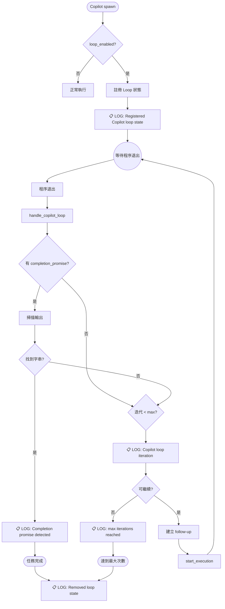

# Copilot Loop 知識記憶檔案

## 1. 核心架構概述

### 1.1 三個關鍵欄位 (copilot.rs)

```rust
pub struct Copilot {
    pub loop_enabled: Option<bool>,        // 啟用 Loop 功能
    pub max_iterations: Option<u32>,       // 最大迭代次數 (預設 5, 最大 100)
    pub completion_promise: Option<String>, // 完成字串 (e.g., '<promise>COMPLETE</promise>')
}
```

### 1.2 核心模組

| 檔案 | 功能 |
|------|------|
| `crates/executors/src/executors/copilot.rs` | Copilot 結構定義，包含 loop 相關欄位 |
| `crates/local-deployment/src/loop_tracker.rs` | Loop 狀態追蹤器 |
| `crates/local-deployment/src/container.rs` | 包含 `handle_copilot_loop` 方法 |

---

## 2. Copilot Loop 關鍵 Log 觀察清單 ⭐

### 2.1 Loop 開始 (Registration)

```
INFO Registered Copilot loop state for workspace {workspace_id}: max_iterations={n}
```

**位置**: `loop_tracker.rs:85-89`

**觸發時機**: 當 Copilot 任務啟動且 `loop_enabled=true` 時

---

### 2.2 Loop 迭代 (Iteration)

```
INFO Copilot loop iteration {current} of {max} for workspace {workspace_id} (can_continue={bool})
```

**位置**: `loop_tracker.rs:109-115`

**觸發時機**: 每次 Copilot 退出後檢查是否繼續迭代

---

### 2.3 完成偵測 (Completion Promise Detected)

```
INFO Completion promise '{promise}' detected in output
```

**位置**: `loop_tracker.rs:151-154`

**觸發時機**: 當輸出中包含設定的完成字串時

---

### 2.4 Loop 完成 - 完成字串偵測

```
INFO Copilot loop complete: completion promise detected for workspace {workspace_id}
```

**位置**: `container.rs:961-964`

**觸發時機**: 成功偵測到完成字串，任務正常結束

---

### 2.5 Loop 完成 - 達到最大迭代

```
INFO Copilot loop complete: max iterations reached for workspace {workspace_id}
```

**位置**: `container.rs:972-975`

**觸發時機**: 迭代次數達到 `max_iterations` 上限

---

### 2.6 Loop 移除

```
INFO Removed Copilot loop state for workspace {workspace_id}
```

**位置**: `loop_tracker.rs:124-126`

**觸發時機**: Loop 結束時清理狀態

---

### 2.7 錯誤 - 無法取得 Session ID

```
ERROR Failed to get session ID from MsgStore for Copilot loop follow-up (workspace {workspace_id})
```

**位置**: `container.rs:989-992`

**觸發時機**: 無法從 MsgStore 取得 Session ID 導致 follow-up 失敗

---

### 2.8 錯誤 - Follow-up 啟動失敗

```
ERROR Failed to start Copilot loop follow-up: {error}
```

**位置**: `container.rs:1033`

**觸發時機**: start_execution 呼叫失敗

---

## 3. 執行流程圖



---

## 4. 如何觀察 Copilot Loop Log

### 4.1 啟動 QA 環境

```bash
cd /var/tmp/vibe-kanban/worktrees/ecc9-dev-003-debug-co/vibe-kanban
pnpm run dev:qa
```

### 4.2 觀察 Backend Log

Backend 會在終端機輸出 tracing log，關鍵字搜尋：

```bash
# 過濾 Copilot Loop 相關 log
grep -E "Copilot loop|completion promise|Registered Copilot"
```

### 4.3 使用 RUST_LOG 調整 Log 級別

```bash
RUST_LOG=debug pnpm run backend:dev:watch
```

---

## 5. 如何觸發 Copilot Loop

### 5.1 透過 UI 設定 (新版 127.0.0.1:9998)

**路徑**: Settings > Agents > COPILOT > DEFAULT Configuration

**可見設定欄位**:
- **Loop Enabled**: Enable automatic loop until task completion (checkbox)
- **Max Iterations**: Maximum number of loop iterations (default: 5, max: 100)
- **Completion Promise**: Exact string that signals task completion (e.g., `<promise>COMPLETE</promise>`)
- **Additional Parameters**: 可加入 `--agent=task-hunter-agent3` 等參數

**建立任務步驟**:
1. 進入專案 Kanban Board
2. 點擊任務卡片
3. 點擊 ATTEMPTS 旁的 "+" 按鈕
4. 在 "Create Attempt" 對話框中選擇：
   - Agent: **COPILOT**
   - Configuration: **DEFAULT** (或其他有 loop 設定的配置)
   - Base branch: **main**
5. 點擊 "Start" 開始執行

### 5.2 Prompt 提示

在 prompt 中加入完成標記指引：

```
完成任務後，請輸出 <promise>COMPLETE</promise> 標記。
若無法完成，請說明原因並繼續嘗試。
```

---

## 6. 關鍵程式碼位置

| 功能 | 檔案 | 行號 |
|------|------|------|
| Copilot struct 定義 | `copilot.rs` | 45-76 |
| CopilotLoopTracker | `loop_tracker.rs` | 1-223 |
| handle_copilot_loop | `container.rs` | 945-1038 |
| register_copilot_loop | `container.rs` | 918-941 |
| spawn_exit_monitor | `container.rs` | 344-563 |

---

## 7. 驗證清單

- [ ] 觀察到 "Registered Copilot loop state" log
- [ ] 觀察到 "Copilot loop iteration" log
- [ ] 觀察到 "completion promise detected" 或 "max iterations reached"
- [ ] 觀察到 "Removed Copilot loop state" log
